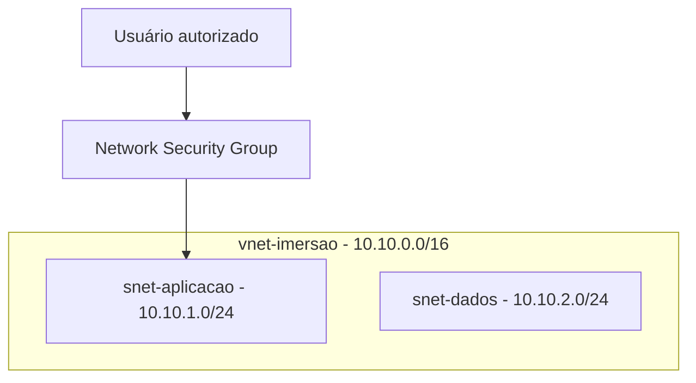
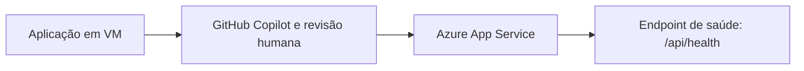
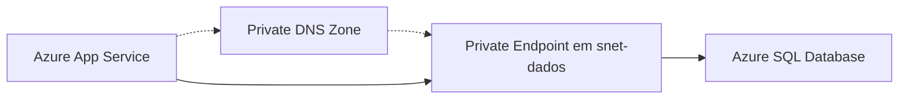
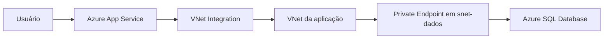
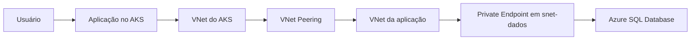

# Imersão Arquiteto Azure — Cloud & AI

## Índice

1. [Antes de começar — requisitos mínimos](#1-antes-de-começar--requisitos-mínimos)
   1. [O que é obrigatório](#o-que-é-obrigatório)
   2. [Preparação no Portal e no Cloud Shell](#preparação-no-portal-e-no-cloud-shell)
   3. [Recomendado](#recomendado)
   4. [Dia 2: requisito adicional](#dia-2-requisito-adicional)
   5. [Opcional e avançado: Copilot e Azure MCP](#opcional-e-avançado-copilot-e-azure-mcp)
   6. [Requisitos por dia](#requisitos-por-dia)
   7. [O que NÃO instalar antes](#o-que-não-instalar-antes)
   8. [Checklist de 15 minutos antes da aula](#checklist-de-15-minutos-antes-da-aula)
2. [Introdução da Imersão](#2-introdução-da-imersão)
   1. [Camadas lógicas da AzureShop](#camadas-lógicas-da-azureshop)
   2. [Workflow de alto nível](#workflow-de-alto-nível)
3. [Dia 1 — Fundamentos, aplicação e dados seguros pelo Portal do Azure](#3-dia-1--fundamentos-aplicação-e-dados-seguros-pelo-portal-do-azure)
   1. [Laboratório 1 — Preparação do ambiente](#laboratório-1--preparação-do-ambiente)
   2. [Laboratório 2 — Rede fundamental](#laboratório-2--rede-fundamental)
   3. [Laboratório 3 — GitHub Copilot e modernização de VM para App Service](#laboratório-3--github-copilot-e-modernização-de-vm-para-app-service)
   4. [Laboratório 4 — Migração para Azure App Service](#laboratório-4--migração-para-azure-app-service)
   5. [Laboratório 5 — Azure SQL Database](#laboratório-5--azure-sql-database)
   6. [Laboratório 6 — Private Endpoint e Private DNS Zone](#laboratório-6--private-endpoint-e-private-dns-zone)
   7. [Laboratório 7 — VNet Integration do Azure App Service](#laboratório-7--vnet-integration-do-azure-app-service)
4. [Fechamento do Dia 1](#4-fechamento-do-dia-1)
5. [Dia 2 — Automação, ACR e AKS com Terraform](#5-dia-2--automação-acr-e-aks-com-terraform)
   1. [Laboratório 8 — Preparação do Terraform](#laboratório-8--preparação-do-terraform)
   2. [Laboratório 9 — Nova VNet, ACR e AKS com Terraform](#laboratório-9--nova-vnet-acr-e-aks-com-terraform)
   3. [Laboratório 10 — VNet Peering, DNS privado e NSG pelo Portal](#laboratório-10--vnet-peering-dns-privado-e-nsg-pelo-portal)
   4. [Laboratório 11 — GitHub Copilot, Azure MCP e Azure AI Foundry](#laboratório-11--github-copilot-azure-mcp-e-azure-ai-foundry)
   5. [Laboratório 12 — Publicação da AzureShop no AKS](#laboratório-12--publicação-da-azureshop-no-aks)
   6. [Laboratório Extra — FinOps (opcional)](#laboratório-extra--finops-opcional)
6. [Checklists de validação](#6-checklists-de-validação)
7. [Troubleshooting](#7-troubleshooting)
8. [Encerramento](#8-encerramento)
9. [Referências oficiais](#9-referências-oficiais)

## 1. Antes de começar — requisitos mínimos

Esta imersão começa pelo **Portal do Azure** e pelo **Azure Cloud Shell** para reduzir instalações na máquina. Você não precisa executar a AzureShop localmente para acompanhar os laboratórios. Faça somente as preparações abaixo e confirme qualquer dúvida de acesso, custo ou permissão com o instrutor.

### O que é obrigatório

- **Computador:** Windows, macOS ou Linux atualizado.
- **Navegador:** Microsoft Edge ou Google Chrome em versão atual.
- **Internet:** conexão estável; recomenda-se 10 Mbps ou mais para uma experiência confortável, mas essa não é uma exigência formal do Azure.
- **Conta Microsoft:** e-mail/conta para entrar no [Portal do Azure](https://portal.azure.com/).
- **Assinatura Azure ativa:** confirme que consegue selecionar a assinatura correta. Se precisar criar ou usar uma assinatura compartilhada, alinhe antes com o responsável. Método de pagamento, limite de crédito e cobrança dependem do tipo de assinatura; revise os avisos de custo antes de criar recursos.
- **Acesso Azure:** permissão para ler e criar os recursos do laboratório, ou acesso RBAC definido pelo instrutor.
- **Conta GitHub:** necessária para os exercícios que envolvem GitHub Copilot e para acessar materiais entregues por repositório. Crie ou acesse a conta em [github.com/signup](https://github.com/signup).
- **Projeto AzureShop:** acesso ao projeto oficial entregue no curso.
- **Anotações e credenciais:** papel, caneta ou caderno e um método seguro para guardar credenciais. Não compartilhe senhas, chaves, tokens ou connection strings.

> **Projeto oficial da AzureShop:** [github.com/highexpert-tecnologia/azureshop](https://github.com/highexpert-tecnologia/azureshop). O conteúdo será disponibilizado pelo instrutor ou pelo repositório. Escolha uma opção simples:
>
> - **Download ZIP — não exige Git:** [baixar o projeto](https://github.com/highexpert-tecnologia/azureshop/archive/refs/heads/main.zip).
> - **[Clone — exige Git instalado](https://github.com/highexpert-tecnologia/azureshop.git):** `https://github.com/highexpert-tecnologia/azureshop.git`

### Preparação no Portal e no Cloud Shell

1. Abra o [Portal do Azure](https://portal.azure.com/) e entre com a conta correta.
2. Em **Subscriptions**, confirme o diretório, a assinatura e o contexto definidos para a turma.
3. Abra o [Azure Cloud Shell](https://learn.microsoft.com/azure/cloud-shell/overview) e escolha **Bash** como opção preferencial.
4. Na primeira abertura, o Cloud Shell pode pedir para criar ou selecionar armazenamento persistente. Ele usa recursos de armazenamento para manter arquivos entre sessões e pode gerar custo baixo; leia a tela e confirme apenas se estiver de acordo com a assinatura escolhida.
5. Confirme com o instrutor a região a ser usada em cada laboratório. Região, quota e disponibilidade devem ser verificadas no momento do exercício.

### Recomendado

- **[Visual Studio Code atualizado](https://code.visualstudio.com/Download):** recomendado para ler e editar o projeto e os arquivos Terraform; não é obrigatório para os laboratórios do Dia 1.
- **[GitHub Copilot no VS Code](https://marketplace.visualstudio.com/items?itemName=GitHub.copilot):** instale a extensão oficial se desejar usá-la. O GitHub Copilot Free depende de elegibilidade e disponibilidade e é apenas um apoio ao aprendizado; o Laboratório 3 também pode ser acompanhado com a orientação do instrutor.
- **Extensões auxiliares do VS Code:** Azure Account/Azure Tools e Terraform (HashiCorp) podem facilitar navegação e edição, mas não são requisitos para concluir o Dia 1.
- **[Git](https://git-scm.com/downloads):** instale somente se optar por clonar e versionar o repositório. Baixar o ZIP do projeto continua sendo uma alternativa válida.
- **Docker:** não é necessário no Dia 1. No Dia 2, use-o somente se o laboratório realmente executar um build local. Quando aplicável, siga a alternativa de build no ACR, Cloud Shell ou ambiente do instrutor indicada no material.

### Dia 2: requisito adicional

Para os laboratórios de Terraform, use a [CLI do Terraform](https://developer.hashicorp.com/terraform/install) instalada na máquina **somente se não for usar** a alternativa disponível ou configurável no Cloud Shell, conforme orientação do instrutor. A Azure CLI já é fornecida pelo Cloud Shell; não é necessário instalá-la localmente para acompanhar a trilha baseada no navegador.

O acesso mínimo necessário varia conforme a ação. Use `[definir]` ou confirme com o instrutor as permissões RBAC aplicáveis em vez de presumir uma função. AKS e serviços de IA podem depender de quota, região e capacidade. Quando não houver disponibilidade, use o ambiente de demonstração ou a contingência definida pelo instrutor.

### Opcional e avançado: Copilot e Azure MCP

GitHub Copilot é apoio de aprendizado, não pré-requisito. A extensão do VS Code pode ser usada quando estiver disponível, mas as atividades possuem alternativas pelo Portal, Cloud Shell, CLI ou Terraform.

O Azure MCP é uma integração com ferramentas conectadas quando disponível; não é uma extensão oficial única exigida pelo curso. Seu uso no Dia 2 é opcional e depende de disponibilidade, conta e RBAC adequados. Nunca cole segredos, chaves, tokens ou connection strings em prompts, chats, arquivos de configuração ou comandos compartilhados.

### Requisitos por dia

| Dia | Necessário para acompanhar | Recursos recomendados ou condicionais |
|---|---|---|
| Dia 1 | Navegador, [Portal do Azure](https://portal.azure.com/), [Cloud Shell](https://learn.microsoft.com/azure/cloud-shell/overview), assinatura ativa, acesso RBAC definido, [conta GitHub](https://github.com/signup) e projeto AzureShop disponível para leitura. | [VS Code](https://code.visualstudio.com/Download), [Git](https://git-scm.com/downloads) e [GitHub Copilot](https://marketplace.visualstudio.com/items?itemName=GitHub.copilot) para análise do projeto. |
| Dia 2 | Itens do Dia 1 e [Terraform](https://developer.hashicorp.com/terraform/install) na máquina **ou** alternativa aprovada no Cloud Shell, conforme orientação do instrutor. | VS Code/Git, build local com Docker somente quando solicitado, e acesso a AKS, ACR e IA conforme quota, região e capacidade. |

### O que NÃO instalar antes

Não instale Kubernetes, `kubectl`, Docker ou Azure CLI local apenas para se preparar. Se você usar o Cloud Shell, essas ferramentas locais não são necessárias para os primeiros passos. O instrutor avisará caso algum laboratório exija uma instalação específica ou uma ferramenta adicional.

### Checklist de 15 minutos antes da aula

- [ ] Entrei no [Azure](https://portal.azure.com/) e no [GitHub](https://github.com/signup).
- [ ] Abri o [Portal do Azure](https://portal.azure.com/) e confirmei a assinatura correta.
- [ ] Abri o [Cloud Shell](https://learn.microsoft.com/azure/cloud-shell/overview) em Bash e confirmei a decisão sobre armazenamento persistente.
- [ ] Baixei o [ZIP da AzureShop](https://github.com/highexpert-tecnologia/azureshop/archive/refs/heads/main.zip) ou preparei o clone com [Git](https://git-scm.com/downloads).
- [ ] Instalei o [VS Code](https://code.visualstudio.com/Download) e o [GitHub Copilot](https://marketplace.visualstudio.com/items?itemName=GitHub.copilot) apenas se desejar usá-los.
- [ ] Para o Dia 2 sem Cloud Shell, instalei o [Terraform](https://developer.hashicorp.com/terraform/install) conforme orientação do instrutor.
- [ ] Confirmei e-mail e autenticação em dois fatores (2FA), quando exigida pela conta.
- [ ] Revisei com o responsável o orçamento, os limites e a política de custo da assinatura.
- [ ] Sei com quem falar caso não tenha permissão, quota ou região disponível.

> **Segurança e custos:** trabalhe somente na assinatura autorizada, não compartilhe credenciais e não crie recursos fora do escopo do laboratório. Em caso de dúvida, pare e confirme com o instrutor antes de aceitar cobranças, criar armazenamento ou alterar recursos.

## 2. Introdução da Imersão

Nesta imersão você evoluirá a aplicação **AzureShop**, um e-commerce em Node.js, desde uma aplicação local até uma aplicação publicada no Azure com banco de dados privado e execução em Kubernetes.

Ao final dos dois dias, você deverá conseguir explicar e demonstrar:

- como o Azure App Service executa uma aplicação PaaS;
- como o Azure SQL Database armazena o estado da aplicação;
- como Private Endpoint, Private DNS Zone, NSG e VNet Integration protegem a conexão com o banco;
- por que a automação é importante para infraestrutura moderna;
- como Terraform declara a infraestrutura;
- como uma imagem é criada no Azure Container Registry (ACR) e publicada no Azure Kubernetes Service (AKS);
- como o AKS acessa o mesmo Azure SQL Database por rede privada.

### Camadas lógicas da AzureShop

A AzureShop separa responsabilidades para que a experiência do usuário, as regras de negócio e os serviços de plataforma evoluam sem misturar decisões de interface, dados, segurança e operação.

| Camada | Responsabilidade | Dependências principais |
|---|---|---|
| Experiência e apresentação | Exibir catálogo, navegação, carrinho e checkout no navegador. | HTTPS e API da AzureShop. |
| Aplicação e API | Executar a aplicação Node.js/Express, as regras de negócio e os endpoints `/api/health`, `/api/products` e `/api/orders`. | Camada de dados, configuração segura, IA quando aplicável e telemetria. |
| Dados | Persistir o estado da aplicação no Azure SQL Database. | Private Endpoint, Private DNS Zone, NSG e conectividade privada na porta TCP 1433. |
| IA | Enriquecer recursos que demandem Azure AI Foundry/Azure OpenAI. Modelo, deployment, região, quota e capacidade permanecem como `[definir]`. | Identidade gerenciada; Key Vault somente quando um segredo for realmente necessário; limites e telemetria. |
| Identidade e segurança | Aplicar RBAC e identidade gerenciada (MI), reduzindo a necessidade de chaves. | Permissões mínimas para ACR, dados, Key Vault quando necessário e serviços de IA. |
| Plataforma e rede | Hospedar a aplicação no App Service no Dia 1 e no AKS no Dia 2; manter ACR, VNets, VNet Integration, peering, DNS privado e NSG. | Recursos de rede aprovados, imagens no ACR e regras de menor privilégio. |
| Observabilidade | Coletar logs, métricas, traces e sinais operacionais. | Application Insights, Azure Monitor e Log Analytics, sem registrar segredos ou dados desnecessários. |

### Workflow de alto nível

O workflow ilustrado apresenta a evolução da aplicação sem expor nomes de recursos, IPs, chaves, tokens ou dados de clientes. No Dia 1, a camada de aplicação é hospedada no App Service; no Dia 2, ela passa a ser executada por pods no AKS.


> **Figura — Workflow da AzureShop:** o usuário navega pela experiência da aplicação, que evolui de App Service para AKS; a API acessa o SQL por Private Endpoint e DNS privado, usa identidade gerenciada para IA e Key Vault quando necessário, e envia telemetria para os serviços de monitoramento.


> Material de topologia gerado e documentado com o [Azure Architecture Diagram Builder](https://github.com/Arturo-Quiroga-MSFT/azure-architecture-diagram-builder), revisado para este workshop sem dados sensíveis. A [fonte vetorial editável](architecture-assets/azure-shop-topology.svg) e a [arquitetura de referência](ARCHITECTURE.md) complementam o diagrama.

### Serviços utilizados

| Serviço | Uso na imersão |
|---|---|
| Azure App Service | Hospedagem PaaS da aplicação no Dia 1 |
| Azure SQL Database | Banco de dados relacional da AzureShop |
| Azure Virtual Network | Segmentação de rede e conectividade privada |
| Network Security Group | Regras de tráfego com menor privilégio |
| Private Endpoint | IP privado para o Azure SQL Server |
| Private DNS Zone | Resolução privada do hostname do Azure SQL |
| Azure Container Registry | Registro de imagens de contêiner |
| Azure Kubernetes Service | Execução da AzureShop no Dia 2 |
| Azure Key Vault | Evolução para armazenamento seguro de segredos |
| GitHub Copilot | Apoio à análise e modernização do código |
| Terraform | Infraestrutura declarativa e reproduzível |

### Estrutura local do projeto

Use esta árvore para localizar os materiais da AzureShop durante os laboratórios:

```text
/
├── .github/
├── data/
├── docs/
│   └── architecture-assets/
├── infra/
│   ├── k8s/
│   ├── sql/
│   └── terraform/
├── public/
├── src/
│   └── db/
├── test/
├── .env.example
├── docker-compose.yml
├── Dockerfile
├── package.json
├── package-lock.json
└── README.md
```

- `docs/`: material da imersão, arquitetura e artefatos visuais.
- `data/` e `test/`: dados locais do projeto e testes automatizados.
- `infra/`: arquivos de Kubernetes, esquema SQL e infraestrutura em Terraform.
- `public/`: frontend responsivo e assets públicos.
- `src/`: API Express, regras de negócio e acesso a dados.
- `src/db/`: implementações de persistência.
- `Dockerfile`, `docker-compose.yml` e `package.json`: definição de contêiner, composição local e metadados da aplicação.

## 3. Dia 1 — Fundamentos, aplicação e dados seguros pelo Portal do Azure

No Dia 1, todos os recursos Azure são criados e explorados pelo **Portal do Azure**. O objetivo é visualizar os serviços, entender suas dependências e validar a aplicação antes da evolução para contêineres no Dia 2.

### Laboratório 1 — Preparação do ambiente

**Objetivo:** preparar a subscrição e criar o Resource Group do laboratório.

**Você desenvolverá:** leitura do contexto da subscrição, organização por Resource Group, tags, custo e auditoria.

**Pré-requisitos:**

- assinatura Azure ativa;
- permissão para criar Resource Groups;
- acesso ao [Portal do Azure](https://portal.azure.com).

**Passos pelo Portal:**

1. Entre no Portal do Azure.
2. Confirme o diretório e selecione a subscrição correta.
3. Abra **Subscriptions** e confira o status e o limite de custo disponível.
4. Abra **Resource groups** e selecione **Create**.
5. Informe o nome do Resource Group do laboratório: `[definir]`.
6. Selecione uma região disponível: `[definir]`.
7. Na guia de tags, adicione:
   - `ambiente = [definir]`
   - `curso = Imersao-Arquiteto-Azure`
   - `responsavel = [definir]`
   - `custo = [definir]`
8. Revise e crie o Resource Group.
9. No Resource Group criado, abra **Cost Management**, **Activity log** e **Resource visualizer**.

**Validação:**

- [ ] O Resource Group aparece na subscrição correta.
- [ ] As quatro tags estão visíveis.
- [ ] O Activity Log registra a criação.
- [ ] O Resource Visualizer está disponível para acompanhar os próximos recursos.

**Boas práticas:**

- Use tags desde o primeiro recurso.
- Confirme a subscrição antes de criar qualquer recurso.
- Mantenha os recursos do laboratório no Resource Group criado neste laboratório.

**Erros comuns:**

- Criar recursos na subscrição errada.
- Escolher uma região sem disponibilidade de SKU.
- Não registrar tags de responsável e custo.

**Custo e atenção:** revise o custo estimado em cada tela de criação e encerre recursos que não serão usados após a imersão.

**Resumo:** você organizou o ambiente, confirmou o contexto e preparou ferramentas de custo, auditoria e visualização.

### Laboratório 2 — Rede fundamental

**Objetivo:** criar a rede da aplicação, subnets e regras iniciais de segurança.

**Você desenvolverá:** conceitos de VNet, subnet, NSG, regras inbound/outbound, prioridade e menor privilégio.

**Pré-requisitos:**

- Laboratório 1 concluído.
- Resource Group do laboratório disponível.

**Passos pelo Portal:**

1. Abra **Virtual networks** e selecione **Create**.
2. Crie a VNet da aplicação com o nome `vnet-imersao`.
3. Configure o espaço de endereços `10.10.0.0/16`.
4. Crie a subnet da aplicação:
   - nome: `snet-aplicacao`;
   - prefixo: `10.10.1.0/24`.
5. Crie também a subnet de dados:
   - nome: `snet-dados`;
   - prefixo: `10.10.2.0/24`.
6. Crie um Network Security Group para a aplicação.
7. Em **Inbound security rules**, crie uma regra restrita para o tráfego necessário no laboratório. Use IP/CIDR confirmado em vez de `Any` ou `*`.
8. Explique as regras padrão outbound e por que uma regra inbound aberta é insegura.
9. Observe a prioridade: números menores são avaliados antes.
10. Associe o NSG apenas à subnet que precisa da proteção definida.



**Validação:**

- [ ] A VNet `vnet-imersao` usa `10.10.0.0/16`.
- [ ] `snet-aplicacao` usa `10.10.1.0/24`.
- [ ] `snet-dados` usa `10.10.2.0/24`.
- [ ] O NSG está associado à subnet planejada.
- [ ] Nenhuma regra criada usa origem ampla sem justificativa.

**Boas práticas:**

- Separe aplicação e dados em subnets diferentes.
- Não coloque o Private Endpoint na mesma subnet da VNet Integration.
- Restrinja origem, destino, protocolo e porta.

**Erros comuns:**

- Criar prefixos sobrepostos.
- Associar o NSG à subnet errada.
- Criar regra com prioridade que não é avaliada como esperado.
- Liberar SSH, HTTP ou portas da aplicação para toda a Internet.

**Custo e atenção:** VNet, subnet e NSG não são o principal custo do laboratório; o risco está em regras excessivamente permissivas.

**Resumo:** você criou a base de rede e aplicou o princípio do menor privilégio.

### Laboratório 3 — GitHub Copilot e modernização de VM para App Service

**Objetivo:** analisar a AzureShop e preparar uma migração responsável de uma aplicação hospedada em VM para Azure App Service.

**Você desenvolverá:** leitura assistida de código, identificação de configuração, health check, estado local, dependências de runtime e decisões de modernização para PaaS.

**Pré-requisitos:**

- Laboratórios 1 e 2 concluídos.
- Código da AzureShop disponível localmente.
- GitHub Copilot disponível no editor, quando autorizado pela organização.

**Atividade guiada com GitHub Copilot:**

1. Abra o repositório da AzureShop no editor e peça ao Copilot para localizar:
   - ponto de entrada da aplicação;
   - versão e dependências de Node.js;
   - porta de escuta;
   - endpoint de health check;
   - variáveis de ambiente;
   - arquivos que não podem ser tratados como estado persistente.
2. Use um prompt seguro:

   ```text
   Analise a AzureShop em Node.js para migração de uma VM para Azure App Service.
   Identifique runtime, porta, endpoint de health check, variáveis de ambiente,
   dependências de sistema de arquivos e riscos de estado local. Não sugira nem
   exponha segredos, tokens, senhas, dados de clientes ou configurações privadas.
   Produza uma checklist curta para validação humana antes da migração.
   ```

3. Compare a resposta com `package.json`, `src/`, `public/` e `/api/health`.
4. Registre as configurações necessárias para o App Service com valores confirmados ou `[definir]`.
5. Use o Copilot apenas como apoio de análise. A validação do código, as decisões de arquitetura e a criação de recursos continuam sob revisão humana.



**Validação:**

- [ ] Runtime, porta e health check foram confirmados no código.
- [ ] Variáveis de ambiente foram separadas de segredos.
- [ ] Dependências de estado local foram identificadas.
- [ ] A checklist de migração foi revisada por uma pessoa.

**Erros comuns:**

- Aceitar sugestão do Copilot sem conferir o código.
- Compartilhar `.env`, chaves, senhas ou dados de clientes no chat.
- Pressupor que o disco local do App Service substitui um banco de dados.

**Resumo:** você preparou a modernização da aplicação com assistência de IA e revisão humana, sem alterar recursos Azure fora do Portal.

### Laboratório 4 — Migração para Azure App Service

**Objetivo:** criar e publicar a AzureShop em Azure App Service.

**Você desenvolverá:** plano do App Service, runtime, variáveis de ambiente, deploy e health check.

**Pré-requisitos:**

- Laboratórios 1, 2 e 3 concluídos.
- Código da AzureShop disponível.

**Passos pelo Portal:**

1. Abra **Planos do App Service** e crie um plano Linux compatível com o laboratório.
2. Abra **App Services** e selecione **Create**.
3. Selecione o Resource Group do laboratório e o plano criado.
4. Configure a pilha Node.js compatível com a aplicação. O projeto requer Node.js 20 ou superior.
5. Crie o App Service e abra o recurso.
6. Em **Environment variables**, configure inicialmente:

   | Nome | Valor |
   |---|---|
   | `APP_ENV` | `azure` |
   | `DB_PROVIDER` | `sqlite` |
   | `SQLITE_PATH` | `/home/data/loja.db` |

7. Não inclua senhas ou chaves em texto aberto nas variáveis.
8. Em **Deployment Center**, selecione o método de publicação aprovado para o laboratório e conclua o fluxo pelo Portal.
9. Antes de confirmar a publicação, revise os arquivos enviados e exclua `.env`, credenciais, chaves e dados locais.
10. Abra o domínio padrão do App Service.
11. Valide `https://[definir]/api/health`.

**Validação:**

- [ ] A aplicação abre pelo domínio padrão.
- [ ] `/api/health` responde com status saudável.
- [ ] O catálogo é carregado.
- [ ] Carrinho e checkout continuam funcionando.

**Boas práticas:**

- Use variáveis de ambiente para configuração.
- Use referência do Key Vault para segredos em uma evolução posterior.
- Mantenha o health check configurado para `/api/health`.

**Erros comuns:**

- Runtime incompatível com Node.js.
- Publicar `node_modules`, `.env` ou dados locais no pacote.
- Informar URL, nome de App Service ou Resource Group incorretos no deploy.

**Custo e atenção:** o plano do App Service possui custo enquanto estiver ativo. Confira a SKU antes da criação.

**Resumo:** você publicou uma aplicação PaaS e separou configuração do código.

### Laboratório 5 — Azure SQL Database

**Objetivo:** criar Azure SQL Server e Azure SQL Database e conectar a aplicação.

**Você desenvolverá:** servidor lógico, database, SKU, diagnóstico, métricas e conexão da aplicação.

**Pré-requisitos:**

- Laboratório 4 concluído.
- App Service acessível.

**Passos pelo Portal:**

1. Abra **SQL databases** e selecione **Create**.
2. Selecione o Resource Group do laboratório.
3. Crie o banco com o nome `imersao`.
4. Crie ou selecione o servidor lógico do Azure SQL. Nome do servidor: `[definir]`.
5. Selecione a região disponível para o servidor: `[definir]`.
6. Configure a opção de computação disponível e aprovada para o laboratório. Valide a disponibilidade atual no Portal antes de criar.
7. Revise a estimativa de custo.
8. Conclua a criação e abra o banco.
9. Abra **Query editor** ou o método autorizado para aplicar `infra/sql/schema.sql`.
10. Configure a aplicação:

   | Nome | Valor |
   |---|---|
   | `DB_PROVIDER` | `sqlserver` |
   | `AZURE_SQL_SERVER` | `[servidor].database.windows.net` |
   | `AZURE_SQL_DATABASE` | `imersao` |
   | `AZURE_SQL_USER` | `[definir]` |
   | `AZURE_SQL_PASSWORD` | referência segura ou `[definir]` |

11. Reinicie o App Service se o Portal solicitar.
12. Faça um pedido na AzureShop e confirme o resultado no banco.
13. Explore **Metrics**, **Diagnostic settings** e a página de custo.

**Validação:**

- [ ] O banco `imersao` existe.
- [ ] As tabelas da AzureShop foram criadas.
- [ ] A aplicação responde ao health check usando o provedor SQL.
- [ ] Um pedido criado na aplicação aparece no banco.

**Boas práticas:**

- Use o hostname normal do SQL: `[servidor].database.windows.net`.
- Não registre senha no Git, em scripts ou na imagem.
- Planeje a autenticação Microsoft Entra e o Key Vault.

**Erros comuns:**

- Confundir o servidor lógico com o database.
- Usar nome ou senha incorretos.
- Alterar a configuração do App Service sem reiniciar.
- Considerar firewall público como arquitetura final.

**Custo e atenção:** o Azure SQL Database possui cobrança por SKU e armazenamento. Consulte custo, métricas e diagnósticos antes de aumentar capacidade.

**Resumo:** você externalizou o estado da aplicação para o Azure SQL Database e validou a conexão.

### Laboratório 6 — Private Endpoint e Private DNS Zone

**Objetivo:** proteger o Azure SQL com IP privado e DNS privado.

**Você desenvolverá:** diferença entre endpoint público, firewall, Private Endpoint e Private DNS Zone.

**Pré-requisitos:**

- Laboratórios 2 e 5 concluídos.
- `vnet-imersao` com `snet-dados`.
- Azure SQL Server disponível.

**Passos pelo Portal:**

1. Abra `vnet-imersao` e confirme que `snet-dados` usa `10.10.2.0/24`.
2. Mantenha `snet-dados` exclusiva para o Private Endpoint. Não crie VMs, AKS ou VNet Integration nessa subnet.
3. Abra o Azure SQL Server.
4. Em **Networking**, abra **Private endpoint connections** e selecione **Create private endpoint**.
5. Selecione o subrecurso `sqlServer`.
6. Selecione `vnet-imersao` e a subnet `snet-dados`.
7. Em DNS, crie ou selecione a Private DNS Zone:

   ```text
   privatelink.database.windows.net
   ```

8. Crie o vínculo da zona privada com `vnet-imersao`, com registro automático desabilitado.
9. Confira se a conexão do Private Endpoint está `Approved`.
10. Confirme o IP privado atribuído ao Private Endpoint.



**Conceitos importantes:**

- O **firewall** controla acesso ao endpoint público do Azure SQL.
- O **Private Endpoint** cria um caminho privado para o subrecurso `sqlServer`.
- A aplicação continua usando `[servidor].database.windows.net`.
- A Private DNS Zone faz o hostname normal resolver para o IP privado dentro da VNet vinculada.
- Não use o IP privado ou `privatelink.database.windows.net` diretamente em `AZURE_SQL_SERVER`.

**Validação:**

- [ ] O Private Endpoint está `Approved`.
- [ ] Ele está em `snet-dados`.
- [ ] A zona `privatelink.database.windows.net` existe.
- [ ] A zona está vinculada a `vnet-imersao`.
- [ ] O hostname normal do SQL resolve para o IP privado a partir da rede vinculada.

**Boas práticas:**

- Valide o caminho privado antes de desabilitar a rede pública do SQL.
- Mantenha zone group associado ao Private Endpoint.
- Use NSG restrito para o fluxo TCP 1433.

**Erros comuns:**

- Criar o Private Endpoint na subnet errada.
- Não vincular a Private DNS Zone à VNet.
- Configurar a aplicação com o nome `privatelink` em vez do hostname normal.
- Desabilitar acesso público antes de validar DNS e TCP 1433.

**Custo e atenção:** Private Endpoint possui custo. Revise a estimativa antes de criar.

**Resumo:** você criou o ponto de entrada privado do Azure SQL e preparou a resolução DNS privada.

### Laboratório 7 — VNet Integration do Azure App Service

**Objetivo:** permitir que o App Service acesse o Azure SQL pelo Private Endpoint.

**Você desenvolverá:** subnet delegada, VNet Integration, regra NSG restrita, DNS privado e validação TCP.

**Pré-requisitos:**

- Laboratório 6 concluído.
- Plano do App Service compatível com VNet Integration.
- Prefixo disponível sem sobreposição: `[definir]`.

**Passos pelo Portal:**

1. Abra `vnet-imersao` e crie uma subnet exclusiva para VNet Integration:
   - nome: `[definir]`;
   - prefixo: `[definir]`.
2. Na criação da subnet, delegue-a a:

   ```text
   Microsoft.Web/serverFarms
   ```

3. Não use `snet-dados` para VNet Integration.
4. Abra o App Service e selecione **Networking**.
5. Em **VNet integration**, selecione **Add VNet**.
6. Escolha `vnet-imersao` e a subnet delegada.
7. No NSG da subnet de dados, crie uma regra TCP 1433 com:
   - origem: subnet da VNet Integration;
   - destino: `snet-dados`;
   - protocolo: TCP;
   - porta de destino: 1433;
   - ação: Allow;
   - prioridade: `[definir]`.
8. Use o hostname normal do SQL na variável `AZURE_SQL_SERVER`.
9. Valide DNS privado, a conexão TCP 1433 e `/api/health`.



**Validação:**

- [ ] A subnet de VNet Integration é exclusiva.
- [ ] A subnet é delegada a `Microsoft.Web/serverFarms`.
- [ ] O App Service mostra VNet Integration configurada.
- [ ] O App Service resolve o SQL para IP privado.
- [ ] A conexão TCP 1433 é bem-sucedida.
- [ ] `/api/health` responde normalmente.

**Boas práticas:**

- VNet Integration é saída do App Service; ela não cria um endpoint privado no App Service.
- Mantenha subnet de VNet Integration e `snet-dados` separadas.
- Libere somente o fluxo necessário no NSG.

**Erros comuns:**

- Tentar usar a subnet do Private Endpoint para VNet Integration.
- Esquecer a delegação `Microsoft.Web/serverFarms`.
- Usar regra NSG ampla como `VirtualNetwork -> *`.
- Resolver o SQL para IP público por ausência de vínculo DNS privado.

**Custo e atenção:** confirme a compatibilidade da SKU do App Service antes de configurar a integração.

**Resumo:** você conectou o App Service ao Azure SQL pelo caminho privado e validou o fluxo de ponta a ponta.

## 4. Fechamento do Dia 1

Hoje você criou e entendeu a arquitetura pelo Portal. Amanhã a AzureShop evoluirá para contêineres e Azure Kubernetes Service.

### Revisão dos recursos

- Resource Group, tags, custo e auditoria.
- `vnet-imersao`, `snet-aplicacao` e `snet-dados`.
- NSG com regras restritas.
- App Service e health check.
- Análise de modernização de VM para App Service com GitHub Copilot e revisão humana.
- Azure SQL Database e esquema da aplicação.
- Private Endpoint, Private DNS Zone e VNet Integration.

### Principais decisões de arquitetura

- O App Service executa a aplicação sem a gestão de sistema operacional.
- O Azure SQL mantém o estado fora do processo da aplicação.
- O Private Endpoint limita o caminho de dados à rede privada.
- DNS privado é necessário para transformar o hostname normal do SQL em IP privado.
- Firewall e Private Endpoint têm finalidades diferentes.

### Checklist do Dia 1

- [ ] Resource Group criado.
- [ ] VNet e subnets criadas.
- [ ] NSG configurado com regras restritas.
- [ ] Modernização de VM para App Service revisada com GitHub Copilot e validação humana.
- [ ] App Service disponível.
- [ ] Azure SQL Database criado.
- [ ] Private Endpoint aprovado.
- [ ] Private DNS Zone criada e vinculada à VNet.
- [ ] VNet Integration do App Service configurada.
- [ ] App Service resolve SQL para IP privado.
- [ ] App Service conecta ao SQL na porta 1433.
- [ ] Health check da aplicação funcionando.

### Perguntas de reflexão

1. Por que a aplicação usa `[servidor].database.windows.net` mesmo com Private Endpoint?
2. Por que VNet Integration e Private Endpoint precisam de subnets diferentes?
3. O que aconteceria se a Private DNS Zone não estivesse vinculada à VNet?
4. Qual é a diferença entre permitir um IP no firewall e usar Private Endpoint?

## 5. Dia 2 — Automação, ACR e AKS com Terraform

No Dia 2, Terraform será usado para declarar e revisar a infraestrutura necessária para a evolução da aplicação em AKS. Também será apresentada uma integração segura e opcional da AzureShop com Azure AI Foundry e Azure OpenAI.

Os Laboratórios 8 a 12 compõem o conteúdo obrigatório do Dia 2. Depois de concluí-los, o **Laboratório Extra — FinOps** é recomendado para aprofundar decisões de custo a partir da arquitetura já fornecida, mas não bloqueia a conclusão dos laboratórios principais.

Terraform permite:

- infraestrutura reproduzível;
- versionamento e revisão de mudanças;
- consistência entre ambientes;
- leitura prévia das alterações por meio de `terraform plan`;
- redução de configurações manuais divergentes.

Arquivos principais:

| Arquivo | Responsabilidade |
|---|---|
| `main.tf` | Conecta módulos e estágios da infraestrutura |
| `variables.tf` | Declara variáveis de entrada |
| `outputs.tf` | Expõe informações úteis após o provisionamento |
| `terraform.tfvars` | Valores do ambiente local, sem segredos |
| `providers.tf` | Provider Azure e configuração de estado |
| `modules/` | Componentes reutilizáveis de rede, SQL, ACR, AKS e outros serviços |

### Laboratório 8 — Preparação do Terraform

**Objetivo:** preparar o ambiente Terraform e revisar o plano antes de qualquer aplicação.

**Pré-requisitos:**

- Azure CLI autenticada.
- Terraform instalado.
- Permissão para criar os recursos planejados.
- Pasta `infra/terraform/` disponível.

**Passos:**

1. Autentique-se:

   ```bash
   az login
   az account show
   ```

2. Se necessário, selecione a subscrição:

   ```bash
   az account set --subscription "[definir]"
   ```

3. Navegue até a pasta Terraform:

   ```bash
   cd infra/terraform
   ```

4. Copie o modelo de variáveis:

   ```bash
   copy terraform.tfvars.example terraform.tfvars
   ```

   No macOS/Linux:

   ```bash
   cp terraform.tfvars.example terraform.tfvars
   ```

5. Preencha apenas valores confirmados.
6. Não grave senha SQL no arquivo. Use variável de ambiente:

   ```bash
   # PowerShell
   $env:TF_VAR_sql_admin_password = "[definir]"
   ```

7. Execute:

   ```bash
   terraform init
   terraform fmt -check
   terraform validate
   terraform plan -out=tfplan
   ```

8. Leia o plano completo. Só após revisão e aprovação execute:

   ```bash
   terraform apply tfplan
   ```

**O que cada comando faz:**

| Comando | Resultado |
|---|---|
| `terraform init` | Inicializa providers e módulos |
| `terraform fmt -check` | Verifica formatação |
| `terraform validate` | Verifica sintaxe e referências estáticas |
| `terraform plan` | Mostra alterações propostas |
| `terraform apply` | Aplica o plano aprovado |

**Boas práticas:**

- Não pule o `plan`.
- Não publique `terraform.tfvars` com segredos.
- Use Key Vault ou variáveis de ambiente para dados sensíveis.
- Configure backend remoto antes de trabalho colaborativo.

### Laboratório 9 — Nova VNet, ACR e AKS com Terraform

**Objetivo:** provisionar a camada de contêineres com Terraform, ACR e AKS.

**Você desenvolverá:** leitura de módulos Terraform, identidade, permissões, outputs, namespace, deployment, service e probes.

**Passos:**

1. Revise `main.tf` e observe os módulos de rede, ACR e AKS.
2. Confirme as flags de estágio em `terraform.tfvars`.
3. Aplique somente o plano revisado.
4. Revise os outputs para Resource Group, ACR e AKS.
5. Obtenha as credenciais do cluster:

   ```bash
   az aks get-credentials --resource-group "[definir]" --name "[definir]" --overwrite-existing
   kubectl get nodes
   ```

6. Crie ou confirme o namespace:

   ```bash
   kubectl apply -f ../../infra/k8s/namespace.yaml
   kubectl get namespace azure-shop
   ```

7. Revise `infra/k8s/deployment.yaml` e `infra/k8s/service.yaml`.

**Conceitos importantes:**

- O AKS representa uma nova camada de evolução da aplicação.
- A VNet gerenciada pelo AKS é criada junto com o cluster e é distinta da VNet da aplicação criada no Dia 1.
- O ACR armazena imagens e o AKS deve usar identidade com a função `AcrPull`.
- O Deployment controla réplicas e rollout; o Service expõe a aplicação; as probes usam `/api/health`.

**Validação:**

- [ ] Terraform foi inicializado e validado.
- [ ] O plano foi revisado antes do apply.
- [ ] O ACR está disponível.
- [ ] O AKS possui nós prontos.
- [ ] O namespace `azure-shop` existe.

### Laboratório 10 — VNet Peering, DNS privado e NSG pelo Portal

**Objetivo:** conectar, pelo Portal do Azure, a VNet do AKS à VNet da aplicação e permitir acesso privado dos pods ao Azure SQL.

**Você desenvolverá:** peering bidirecional, vínculo da Private DNS Zone com a VNet do AKS, regra NSG restrita e testes de DNS e TCP 1433 a partir de um pod.

**Pré-requisitos:**

- Laboratórios 6, 7 e 9 concluídos.
- VNet do AKS e `vnet-imersao` identificadas, com espaços de endereços sem sobreposição.
- Private Endpoint do SQL aprovado em `snet-dados`.
- Permissão para administrar peerings, vínculos DNS e regras NSG no escopo aprovado.

**Passos pelo Portal:**

1. Abra o recurso AKS e identifique o Resource Group gerenciado e a VNet usada pelo cluster. Registre nomes confirmados como `[definir]`.
2. Abra `vnet-imersao` > **Peerings** > **Add** e crie o peering para a VNet do AKS, permitindo acesso à rede virtual.
3. Abra a VNet do AKS > **Peerings** > **Add** e crie o peering de retorno para `vnet-imersao`, também permitindo acesso à rede virtual.
4. Habilite tráfego encaminhado somente quando o desenho aprovado exigir esse fluxo. Não habilite trânsito de gateway nem gateway remoto sem necessidade documentada.
5. Abra a Private DNS Zone:

   ```text
   privatelink.database.windows.net
   ```

6. Em **Virtual network links**, confirme o vínculo existente com `vnet-imersao` e crie o vínculo com a VNet do AKS. Mantenha o registro automático desabilitado.
7. Abra o NSG associado a `snet-dados` e crie uma regra inbound restrita:
   - origem: prefixos reais da VNet do AKS;
   - destino: `snet-dados`;
   - protocolo: TCP;
   - porta de destino: 1433;
   - prioridade: `[definir]`.
8. Valide o caminho privado antes de desabilitar o acesso público do SQL. Depois da validação e aprovação, desabilite o acesso público pelo Portal quando essa for a decisão da arquitetura.



**Conceito essencial:** peering cria conectividade IP. A Private DNS Zone é necessária para resolver `[servidor].database.windows.net` para o IP privado do Private Endpoint. Peering não substitui DNS privado.

**Validação a partir de um pod:**

```bash
kubectl -n azure-shop run netcheck --image=busybox:1.36 --restart=Never -- sleep 300
kubectl -n azure-shop wait --for=condition=Ready pod/netcheck --timeout=90s
kubectl -n azure-shop exec netcheck -- nslookup "[servidor].database.windows.net"
kubectl -n azure-shop exec netcheck -- nc -zvw5 "[servidor].database.windows.net" 1433
kubectl -n azure-shop delete pod netcheck --ignore-not-found
```

**Validação:**

- [ ] Os dois peerings estão conectados.
- [ ] A zona DNS privada está vinculada a `vnet-imersao` e à VNet do AKS.
- [ ] O pod resolve o hostname normal do SQL para IP privado.
- [ ] A conexão TCP 1433 é permitida pelo NSG.
- [ ] O SQL está sem acesso público após a validação do caminho privado.

### Laboratório 11 — GitHub Copilot, Azure MCP e Azure AI Foundry

**Objetivo:** descobrir ou preparar, de forma controlada, um recurso Microsoft Foundry/Azure OpenAI e um deployment de modelo para uma chamada simples da aplicação.

**Você desenvolverá:** escolha segura entre recurso existente ou novo, validação de modelo e região, autenticação por Microsoft Entra ID, configuração sem segredos no código, observabilidade e limites de consumo.

**Pré-requisitos reais:**

- conta Azure com subscrição ativa;
- RBAC compatível com a ação escolhida: para criar ou administrar o projeto/recurso, uma função como **Foundry Owner** ou **Foundry Account Owner** no escopo adequado; para consumir inferência, a identidade da aplicação ou do usuário precisa da função **Cognitive Services User** no recurso;
- provider `Microsoft.CognitiveServices` registrado na subscrição;
- região, modelo, versão e capacidade disponíveis na subscrição: `[definir]`;
- quota aprovada ou disponível para o modelo e o tipo de deployment: `[definir]`;
- Azure CLI autenticada ou acesso ao Portal/Foundry portal;
- Key Vault disponível caso uma integração não suporte autenticação por identidade gerenciada.

**Autenticação e descoberta:**

1. Autentique-se e confirme o contexto:

   ```bash
   az login
   az account show
   az provider show \
     --namespace Microsoft.CognitiveServices \
     --query registrationState \
     --output tsv
   ```

2. Use **GitHub Copilot Free com Azure MCP**, se ele estiver disponível e já configurado, somente como assistente de descoberta e orientação. Exemplos de perguntas guiadas:
   - “Quais recursos `Microsoft.CognitiveServices` já existem nesta subscrição e qual é o estado deles?”
   - “Quais roles a identidade gerenciada da aplicação possui no recurso `[definir]`?”
   - “Mostre os passos oficiais para verificar quota e deployments sem revelar chaves.”
3. Revise cada resposta e cada comando antes de executá-lo. Não cole chaves, connection strings, tokens, dados de clientes ou conteúdo de Key Vault no chat.
4. Copilot Free e Azure MCP não são requisitos do laboratório. Se não estiverem disponíveis, faça a mesma descoberta pelo Portal, Azure CLI ou Terraform já aprovado pela equipe.

**Escolha do recurso e deployment:**

1. No [Microsoft Foundry](https://ai.azure.com), localize um projeto e recurso existentes aprovados para a imersão. Registre apenas nomes confirmados:
   - Resource Group: `[definir]`;
   - recurso Foundry/Azure OpenAI: `[definir]`;
   - projeto Foundry, se aplicável: `[definir]`;
   - região: `[definir]`.
2. Se não houver recurso existente e houver autorização, use o Portal, Azure CLI ou Terraform documentado pela equipe para criar o recurso. Não crie recursos paralelos apenas para contornar RBAC, quota ou capacidade.
3. No Foundry portal, abra **Discover** > **Models**, selecione somente um modelo que apareça como disponível para a subscrição e região e crie o deployment. Anote:
   - nome do deployment: `[definir]`;
   - modelo e versão: `[definir]`;
   - tipo de deployment e capacidade/quota: `[definir]`.
4. Como alternativa via Azure CLI, use os valores confirmados:

   ```bash
   az cognitiveservices account deployment create \
     --name "[definir: recurso]" \
     --resource-group "[definir]" \
     --deployment-name "[definir]" \
     --model-name "[definir]" \
     --model-version "[definir]" \
     --model-format OpenAI \
     --sku-name "[definir]" \
     --sku-capacity "[definir]"
   ```

5. Confirme o estado do deployment antes de integrá-lo:

   ```bash
   az cognitiveservices account deployment show \
     --name "[definir: recurso]" \
     --resource-group "[definir]" \
     --deployment-name "[definir]" \
     --query properties.provisioningState \
     --output tsv
   ```

**Configuração segura da aplicação:**

- Use a identidade gerenciada do App Service ou do workload no AKS quando a biblioteca e o recurso suportarem autenticação Microsoft Entra ID. Atribua o menor privilégio necessário, normalmente **Cognitive Services User**, ao escopo do recurso.
- Mantenha endpoint e nome do deployment como configuração não secreta, por exemplo `AZURE_OPENAI_ENDPOINT` e `AZURE_OPENAI_DEPLOYMENT`, com valores `[definir]`.
- Nunca exponha chaves no código, no repositório, em `terraform.tfvars`, manifests Kubernetes, imagens de contêiner, logs ou chat.
- Se uma dependência exigir chave, armazene-a no Azure Key Vault e use uma referência do App Service ou mecanismo de injeção de segredo aprovado no AKS. Registre somente o nome do segredo: `[definir]`.
- Prefira identidade gerenciada; chaves são uma exceção temporária, com rotação e acesso mínimo.

**Validação e operação:**

1. No playground do Foundry ou em um cliente autenticado por Microsoft Entra ID, envie uma solicitação simples, sem dados sensíveis, ao deployment `[definir]`.
2. Confirme que a resposta é recebida e que o nome do deployment, endpoint e identidade usados correspondem aos valores aprovados.
3. Revise métricas de requisições, tokens, latência e erros no recurso/Foundry. Quando aprovado, conecte a telemetria da aplicação ao Application Insights sem registrar prompts, respostas ou segredos sensíveis.
4. Acompanhe quota, TPM/RPM e respostas `429`. A capacidade, os limites e o custo variam por modelo, região, tipo de deployment e consumo; consulte o Portal e a documentação atual antes de definir valores.
5. Defina limites de uso, alertas de custo e uma estratégia de retry com backoff antes de qualquer carga real.

**Validação:**

- [ ] O provider `Microsoft.CognitiveServices` está registrado.
- [ ] O recurso existente ou novo foi confirmado no escopo correto.
- [ ] Modelo, versão, região, capacidade e quota foram confirmados antes do deployment.
- [ ] O deployment está com estado `Succeeded`.
- [ ] A identidade usada pela aplicação possui apenas a permissão necessária.
- [ ] Endpoint e nome do deployment estão configurados sem expor segredo.
- [ ] Uma chamada simples foi concluída sem dados sensíveis.
- [ ] Métricas, limites e custo foram revisados.

### Laboratório 12 — Publicação da AzureShop no AKS

**Objetivo:** gerar imagem, publicar no ACR e atualizar o Deployment existente no AKS.

**Você desenvolverá:** Dockerfile, tag imutável, ACR Build, rollout e validação funcional.

**Passos:**

1. Revise o `Dockerfile` existente. Ele instala dependências de produção, copia `src/` e `public/`, expõe a porta 3000 e usa `/api/health`.
2. Se Docker estiver disponível, valide localmente:

   ```bash
   docker build -t azure-shop:local .
   docker run --rm -p 3000:3000 azure-shop:local
   ```

3. Faça build remoto no ACR usando tag imutável:

   ```bash
   az acr build \
     --registry "[definir]" \
     --image "azure-shop:[definir: tag imutável]" \
     .
   ```

4. Confirme a imagem:

   ```bash
   az acr repository show-tags --name "[definir]" --repository azure-shop --output table
   ```

5. Atualize somente o Deployment existente:

   ```bash
   kubectl -n azure-shop set image deployment/azure-shop \
     azure-shop="[definir: login server do ACR]/azure-shop:[definir: tag]"
   kubectl -n azure-shop rollout status deployment/azure-shop
   ```

6. Valide pods e Service:

   ```bash
   kubectl -n azure-shop get deployment,pods,service
   kubectl -n azure-shop logs deployment/azure-shop --tail=100
   ```

7. Abra a URL do Service ou Ingress configurado.
8. Valide `/api/health`, catálogo, carrinho, checkout e imagens do catálogo.
9. Confirme que a aplicação usa o Azure SQL por conectividade privada.

**Boas práticas:**

- Use tag imutável; não dependa de `latest` para rastrear rollout.
- Acompanhe `rollout status` antes de considerar a publicação concluída.
- Não crie um Deployment paralelo para atualizar a aplicação.
- Não habilite usuário administrador do ACR para contornar permissões; use `AcrPull`.

**Validação:**

- [ ] A imagem está no ACR.
- [ ] O rollout foi concluído.
- [ ] Os pods estão `Running` e prontos.
- [ ] O Service ou Ingress expõe a aplicação.
- [ ] Health check, catálogo, carrinho e checkout funcionam.
- [ ] O pod usa resolução DNS privada para o Azure SQL.

### Laboratório Extra — FinOps (opcional)

**Quando realizar:** após concluir os Laboratórios 8 a 12. Esta é uma atividade **opcional e recomendada** para aprofundar a gestão de custos, sem bloquear a conclusão do conteúdo obrigatório do Dia 2.

**Objetivo:** modelar custos da AzureShop sem inventar preços e apoiar uma revisão humana de decisões financeiras.

**Você desenvolverá:** visão de custos fixos, variáveis e ociosos; tags, budgets e alertas; uso de Cost Management e Azure Advisor.

**FinOps como requisito de Arquitetura:**

O custo não é uma etapa posterior ao deploy. Antes de aprovar qualquer ambiente, defina proprietário, tags, estimativa de referência, orçamento, alertas e a ação esperada quando houver consumo acima do planejado.

| Serviço | Custo a observar | Risco de ociosidade ou consumo inesperado |
|---|---|---|
| AKS | Nós, recursos reservados/solicitados e componentes associados ao cluster | Nós sem carga, réplicas excessivas e ambientes de laboratório mantidos ativos |
| Load Balancer e IPs públicos | Configuração e tráfego associados à exposição da aplicação | Serviços/IPs que permanecem provisionados sem uso |
| ACR | Armazenamento, operações e retenção de imagens | Tags antigas e imagens sem política de limpeza |
| Azure SQL Database | SKU, computação, armazenamento, backup e recursos configurados | Banco mantido em SKU inadequada ao laboratório |
| Private Endpoint | Recurso de conectividade privada e tráfego aplicável | Endpoints mantidos após o encerramento do laboratório |
| App Service | Plano e instâncias provisionadas | Plano ativo sem aplicação ou workload |
| Azure OpenAI | Modelo, tipo de deployment, tokens e capacidade conforme o serviço | Chamadas sem limite, prompts excessivos e quota alocada sem revisão |
| Key Vault | Operações e configuração de segredos | Segredos sem rotação e acesso além do necessário |
| Monitor e Log Analytics | Ingestão, retenção e consultas de telemetria | Logs excessivos, retenção incompatível e dados sensíveis em telemetria |

Não use valores de preço, quotas ou capacidade presumidos. Monte uma estimativa de referência no [Azure Pricing Calculator](https://azure.microsoft.com/en-us/pricing/calculator/) usando somente SKUs, regiões, volumes e configurações confirmados: `[definir]`.

**Atividade FinOps:**

1. Aplique Tags consistentes de `Projeto`, `Ambiente`, `Responsavel` e `CentroDeCusto` com valores confirmados. As tags permitem agrupar e atribuir custos, mas não substituem a revisão de uso.
2. No **Cost Management**, crie ou revise um budget no escopo aprovado e configure alertas em limites `[definir]`. Defina destinatários e procedimento de resposta, sem usar e-mails ou dados pessoais no material.
3. Compare custo acumulado, previsão, uso real e estimativa de referência. Registre mudanças de arquitetura que explicam desvios.
4. Consulte o **Azure Advisor** para recomendações e avalie-as no contexto da aplicação. Advisor é uma fonte de recomendações; a equipe decide e registra se cada ação é aplicável.
5. Para Azure OpenAI, acompanhe requisições, tokens, quota, erros `429` e custo por uso no recurso/Foundry. Aplique limites por aplicação e alertas de orçamento antes de liberar carga real.
6. Ao encerrar o laboratório, remova recursos temporários aprovados ou reduza a capacidade conforme a política da organização. Não desligue, exclua ou escale recursos compartilhados/produção sem autorização explícita.

**Arquitetura para discussão:**

Use a [arquitetura de referência da AzureShop](ARCHITECTURE.md) e sua topologia visual já fornecida para relacionar decisões técnicas aos custos observados. Esta atividade se limita à discussão de FinOps e não cria nem altera recursos.

**Entregas e validação:**

- [ ] Estimativa de referência separa custos fixos, por uso e ociosos sem inventar preços.
- [ ] Tags, Cost Management, budgets, alertas e procedimento de resposta foram revisados.
- [ ] Uso de Azure OpenAI, quotas e limites foram incluídos na revisão de custos.
- [ ] Advisor foi usado como orientação, com revisão humana documentada.
- [ ] A arquitetura fornecida foi consultada na discussão de custos sem criar ou alterar recursos.

## 6. Checklists de validação

### Dia 1

- [ ] Resource Group criado.
- [ ] VNet e subnets criadas.
- [ ] NSG configurado com regras restritas.
- [ ] App Service disponível.
- [ ] Azure SQL Database criado.
- [ ] Private Endpoint aprovado.
- [ ] Private DNS Zone criada e vinculada à VNet.
- [ ] VNet Integration do App Service configurada.
- [ ] App Service resolve SQL para IP privado.
- [ ] App Service conecta ao SQL na porta 1433.
- [ ] Health check da aplicação funcionando.

### Dia 2

- [ ] Terraform inicializado e validado.
- [ ] Plano revisado antes do apply.
- [ ] VNet do AKS criada ou identificada.
- [ ] ACR criado ou configurado.
- [ ] AKS provisionado.
- [ ] VNet Peering bidirecional ativo.
- [ ] Private DNS Zone vinculada à VNet do AKS.
- [ ] Pod resolve SQL para IP privado.
- [ ] Pod conecta ao SQL na porta 1433.
- [ ] Imagem publicada no ACR.
- [ ] Aplicação publicada no AKS.
- [ ] Rollout concluído.
- [ ] Health check e funcionalidades principais validadas.
- [ ] Provider `Microsoft.CognitiveServices` registrado.
- [ ] Recurso Foundry/Azure OpenAI e deployment confirmados.
- [ ] Modelo, região, capacidade e quota validados com valores confirmados.
- [ ] Identidade gerenciada ou Key Vault configurado sem expor chave.
- [ ] Chamada simples ao deployment validada sem dados sensíveis.
- [ ] Métricas, limites e custo por uso revisados.

### Laboratório Extra — FinOps (opcional)

- [ ] Os Laboratórios 8 a 12 foram concluídos antes de iniciar esta atividade extra.
- [ ] Estimativa de referência separa custos fixos, por uso e ociosos, sem preços inventados.
- [ ] Tags, Cost Management, budget, alertas e destinatários de resposta foram definidos ou registrados como `[definir]`.
- [ ] Uso, quota e limites do Azure OpenAI foram incluídos na revisão de custos.
- [ ] Advisor foi usado como orientação, com revisão humana documentada.
- [ ] A arquitetura de referência foi consultada para discutir os impactos financeiros sem gerar diagramas ou alterar recursos.

## 7. Troubleshooting

| Sintoma | Causa provável | Correção |
|---|---|---|
| Azure CLI não autentica | Conta, tenant ou subscrição incorretos | Execute `az login`, confira `az account show` e selecione a subscrição correta. |
| Sugestão do Copilot não corresponde ao código | Contexto insuficiente ou resposta não revisada | Compare a sugestão com `package.json`, `src/`, `public/` e `/api/health`; não publique sem revisão humana. |
| Publicação pelo Deployment Center falha | Origem, runtime ou configuração da aplicação incorreta | Confirme no Portal o runtime Node.js, os arquivos de publicação, as variáveis não secretas e os logs do App Service. |
| Terraform não inicializa | Terraform ausente, provider inacessível ou pasta errada | Confirme `terraform version`, entre em `infra/terraform` e execute `terraform init`. |
| `terraform plan` mostra valores inesperados | Variável, state ou recurso manual divergente | Pare, compare `terraform.tfvars`, state e Portal; não execute apply sem entender a diferença. |
| Data source da VNet AKS falha no plan | AKS/VNet gerenciada ainda não existe ou nome/RG gerenciado está incorreto | Execute o Laboratório 9 somente depois da criação do AKS e confirme `aks_vnet_name` e `aks_node_resource_group` reais. |
| Subnet do App Service sem delegação | Delegação não configurada | Delegue a subnet exclusiva a `Microsoft.Web/serverFarms`. |
| SQL resolve para IP público | Zona DNS ou vínculo ausente | Confirme zone group do PE e vínculo de `privatelink.database.windows.net` à VNet de origem. |
| Timeout TCP 1433 | NSG, rota, DNS ou PE incorreto | Confirme PE `Approved`, IP privado, regra TCP 1433, DNS e VNet Integration/peering. |
| PE criado, mas aplicação não conecta | Subrecurso, subnet ou DNS incorreto | Confirme `sqlServer`, `snet-dados`, zone group e hostname normal do SQL. |
| Peering em somente um sentido | Apenas uma direção foi criada | Crie e valide os dois peerings. |
| Private DNS Zone não vinculada à VNet do AKS | DNS privado incompleto | Adicione vínculo da zona à VNet do AKS com registro automático desabilitado. |
| NSG bloqueia tráfego | Origem, destino ou prioridade incorretos | Restrinja TCP 1433 da origem necessária para `snet-dados` e revise prioridade. |
| Pod não inicia | Imagem, Secret, ConfigMap ou probes falham | Use `kubectl describe pod` e `kubectl logs`. |
| AKS não baixa imagem do ACR | Permissão `AcrPull` ausente ou imagem inexistente | Confirme tag, login server e identidade do kubelet com a função `AcrPull`. |
| Deployment não conclui rollout | Nova réplica não fica pronta | Use `kubectl rollout status`, `kubectl describe deployment` e logs. |
| Aplicação não responde após deploy | Service, porta, health check ou configuração incorretos | Confirme porta 3000, targetPort, probes, variáveis e URL exposta. |
| Provider `Microsoft.CognitiveServices` não está registrado | Provider não habilitado na subscrição | Confirme o estado pelo Portal ou `az provider show`; solicite o registro ao administrador se você não tiver permissão. |
| Modelo não pode ser implantado | Região, modelo, versão, capacidade ou quota indisponível | Consulte o Foundry portal, escolha apenas opções disponíveis e use valores `[definir]`; não suponha capacidade ou quota. |
| Chamada ao modelo retorna 401 ou 403 | Identidade, endpoint, role ou escopo incorreto | Confirme o endpoint, a identidade em execução e a função **Cognitive Services User** no recurso. |
| Chamada retorna 429 ou latência variável | Limite de requisições/tokens ou quota atingida | Revise métricas e quota, reduza a carga e use retry com backoff; não contorne o limite com novos recursos não aprovados. |
| Chave aparece em configuração, log ou chat | Segredo tratado como configuração comum | Revogue e rotacione a chave, remova-a do histórico aplicável e use identidade gerenciada ou Key Vault. |
| Budget ou alerta não informa o responsável | Escopo, tags, limite ou destinatários incompletos | Revise Cost Management com o proprietário do custo e registre valores confirmados como `[definir]`. |
| Diagrama diverge do Terraform ou do ambiente | Informação presumida ou exportação sem revisão | Compare com `terraform plan`, outputs e responsáveis técnicos; corrija a documentação, não a infraestrutura, sem aprovação. |

## 8. Encerramento

O Portal do Azure ajuda a visualizar recursos, dependências e decisões de arquitetura. Terraform permite declarar e revisar a evolução da infraestrutura para AKS de forma reproduzível. Os Laboratórios 8 a 12 concluem o conteúdo obrigatório do Dia 2. O Laboratório Extra de FinOps é recomendado para aprofundar a revisão de custos e decisões conscientes, mas não é pré-requisito nem bloqueia os laboratórios principais.

Ao concluir a imersão, você entende o caminho da AzureShop:

```text
Azure App Service
  -> VNet Integration
  -> Private Endpoint
  -> Azure SQL Database

Azure Kubernetes Service
  -> VNet Peering
  -> Private Endpoint existente
  -> Azure SQL Database
```

Uma arquitetura moderna combina aplicação gerenciada, rede privada, observabilidade, identidade, menor privilégio e automação.

Antes de encerrar:

1. Se optar pelo Laboratório Extra, revise custos, budgets, alertas e recomendações antes de manter o ambiente.
2. Remova recursos temporários aprovados e não altere recursos compartilhados sem autorização.
3. Preserve apenas os valores e segredos necessários nos serviços adequados.
4. Não execute `terraform apply` sem revisar e aprovar o plano.
5. Mantenha a infraestrutura em Terraform; não introduza Bicep gerado na atividade.

## 9. Referências oficiais

- [Repositório oficial da AzureShop](https://github.com/highexpert-tecnologia/azureshop)
- [Arquitetura de referência da AzureShop](ARCHITECTURE.md)
- [Portal do Azure](https://portal.azure.com)
- [Visão geral do Azure Cloud Shell](https://learn.microsoft.com/azure/cloud-shell/overview)
- [Visão geral do Azure RBAC](https://learn.microsoft.com/azure/role-based-access-control/overview)
- [Visual Studio Code](https://code.visualstudio.com/)
- [Planos do GitHub Copilot, incluindo Copilot Free](https://docs.github.com/en/copilot/get-started/plans)
- [Downloads do Git](https://git-scm.com/downloads)
- [Instalar o Terraform](https://developer.hashicorp.com/terraform/install)
- [Node.js no Azure App Service](https://learn.microsoft.com/azure/app-service/quickstart-nodejs)
- [VNet Integration para Azure App Service](https://learn.microsoft.com/azure/app-service/overview-vnet-integration)
- [Azure SQL Database com Private Endpoint](https://learn.microsoft.com/azure/azure-sql/database/private-endpoint-overview)
- [DNS para Azure Private Endpoint](https://learn.microsoft.com/azure/private-link/private-endpoint-dns)
- [Peering de redes virtuais](https://learn.microsoft.com/azure/virtual-network/virtual-network-peering-overview)
- [Azure Container Registry](https://learn.microsoft.com/azure/container-registry/container-registry-get-started-azure-cli)
- [Criar e implantar aplicação no AKS](https://learn.microsoft.com/azure/aks/learn/quick-kubernetes-deploy-cli)
- [GitHub Actions com OpenID Connect no Azure](https://learn.microsoft.com/azure/developer/github/connect-from-azure-openid-connect)
- [Referências do Azure Key Vault no App Service](https://learn.microsoft.com/azure/app-service/app-service-key-vault-references)
- [Azure SQL com autenticação Microsoft Entra](https://learn.microsoft.com/azure/azure-sql/database/authentication-aad-overview)
- [Azure AI Foundry](https://learn.microsoft.com/azure/ai-foundry/)
- [Documentação do GitHub Copilot](https://docs.github.com/en/copilot)
- [Criar recursos e deployment no Microsoft Foundry](https://learn.microsoft.com/azure/foundry/tutorials/quickstart-create-foundry-resources)
- [Autenticação sem chave com Microsoft Entra ID no Foundry](https://learn.microsoft.com/azure/foundry/foundry-models/how-to/configure-entra-id)
- [Quotas e limites do Azure OpenAI no Microsoft Foundry](https://learn.microsoft.com/azure/foundry/openai/quotas-limits)
- [Modelo de custos no Azure Well-Architected Framework](https://learn.microsoft.com/azure/well-architected/cost-optimization/cost-model)
- [Coleta, revisão e alertas de custo no Azure Well-Architected Framework](https://learn.microsoft.com/azure/well-architected/cost-optimization/collect-review-cost-data)
- [Azure Well-Architected Framework](https://learn.microsoft.com/azure/well-architected/what-is-well-architected-framework)
- [Azure Advisor](https://learn.microsoft.com/azure/advisor/advisor-overview)
- [Azure Pricing Calculator](https://azure.microsoft.com/en-us/pricing/calculator/)
- [Azure Architecture Diagram Builder](https://github.com/Arturo-Quiroga-MSFT/azure-architecture-diagram-builder)
