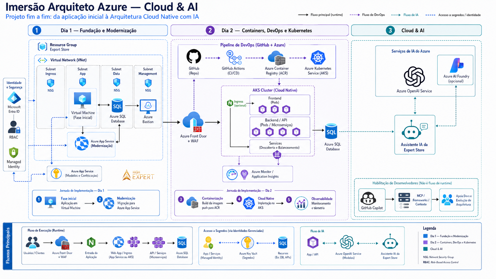
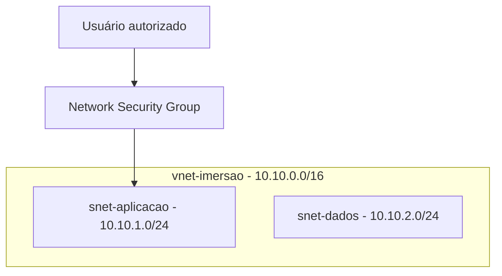
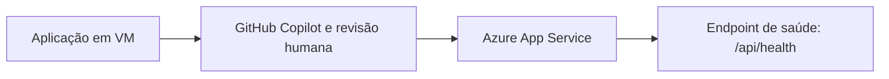
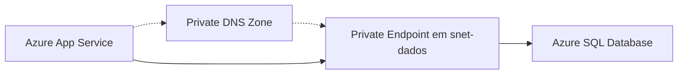
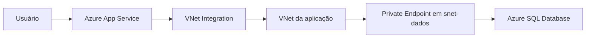
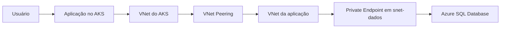

# Imersão Arquiteto Azure — Cloud & AI

## Índice

1. [Antes de começar — requisitos mínimos](#1-antes-de-começar--requisitos-mínimos)
   1. [O que é obrigatório](#o-que-é-obrigatório)
   2. [Preparação no Portal e no Cloud Shell](#preparação-no-portal-e-no-cloud-shell)
   3. [Ferramentas que não são obrigatórias](#ferramentas-que-não-são-obrigatórias)
   4. [Requisitos por dia](#requisitos-por-dia)
   5. [Checklist de 20 minutos antes da aula](#checklist-de-20-minutos-antes-da-aula)
   6. [Matriz de cobertura dos laboratórios](#matriz-de-cobertura-dos-laboratórios)
   7. [Bloqueios conhecidos e como resolver](#bloqueios-conhecidos-e-como-resolver)
2. [Introdução da Imersão](#2-introdução-da-imersão)
   1. [Camadas lógicas da AzureShop](#camadas-lógicas-da-azureshop)
   2. [Workflow de alto nível](#workflow-de-alto-nível)
3. [Dia 1 — Fundamentos, aplicação e dados seguros pelo Portal do Azure](#3-dia-1--fundamentos-aplicação-e-dados-seguros-pelo-portal-do-azure)
   1. [Laboratório 1 — Preparação do ambiente](#laboratório-1--preparação-do-ambiente)
   2. [Laboratório 2 — Rede fundamental](#laboratório-2--rede-fundamental)
   3. [Laboratório 3 — GitHub Copilot e modernização de VM para App Service](#laboratório-3--github-copilot-e-modernização-de-vm-para-app-service)
   4. [Laboratório 4 — Migração para Azure App Service](#laboratório-4--migração-para-azure-app-service)
   5. [Laboratório 5 — Azure SQL Database](#laboratório-5--azure-sql-database)
   6. [Laboratório 6 — Private Endpoint e Private DNS Zone](#laboratório-6--private-endpoint-e-private-dns-zone)
   7. [Laboratório 7 — VNet Integration do Azure App Service](#laboratório-7--vnet-integration-do-azure-app-service)
4. [Fechamento do Dia 1](#4-fechamento-do-dia-1)
5. [Dia 2 — Automação, ACR e AKS com Terraform](#5-dia-2--automação-acr-e-aks-com-terraform)
   1. [Laboratório 8 — Preparação do Terraform](#laboratório-8--preparação-do-terraform)
   2. [Laboratório 9 — ACR e AKS com Terraform (fase 1)](#laboratório-9--acr-e-aks-com-terraform-fase-1)
   3. [Laboratório 10 — VNet Peering, DNS privado e NSG com Terraform (fase 2)](#laboratório-10--vnet-peering-dns-privado-e-nsg-com-terraform-fase-2)
   4. [Laboratório 11 — GitHub Copilot e Azure AI Foundry](#laboratório-11--github-copilot-e-azure-ai-foundry)
   5. [Laboratório 12 — Publicação da AzureShop no AKS](#laboratório-12--publicação-da-azureshop-no-aks)
   6. [Laboratório Extra — FinOps (opcional)](#laboratório-extra--finops-opcional)
6. [Checklists de validação](#6-checklists-de-validação)
7. [Troubleshooting](#7-troubleshooting)
8. [Encerramento](#8-encerramento)
9. [Referências oficiais](#9-referências-oficiais)

## 1. Antes de começar — requisitos mínimos

O caminho oficial desta imersão usa **Portal do Azure + Azure Cloud Shell (Bash)** para as ações Azure, CLI e Terraform. Assim, você não precisa instalar Azure CLI, Terraform, Docker ou `kubectl` localmente. Você precisa, porém, chegar com o projeto clonado, VS Code e GitHub Copilot prontos para que todos os laboratórios sejam executáveis de ponta a ponta.

### O que é obrigatório

1. **Assinatura Azure ativa:** use uma assinatura Trial ou, preferencialmente, Pay-As-You-Go. Consulte [criar e gerenciar assinaturas Azure](https://learn.microsoft.com/azure/cost-management-billing/manage/create-subscription) e entre pelo [Portal do Azure](https://portal.azure.com/). Trial pode ter créditos, limites, quotas e regiões indisponíveis: valide assinatura, cobrança, RBAC, região e quota **antes** da aula.
2. **[Visual Studio Code](https://code.visualstudio.com/Download):** instale e abra o projeto localmente.
3. **[Git](https://git-scm.com/downloads):** é necessário para clonar e acompanhar o fluxo do projeto. O Cloud Shell apoia as ações Azure/CLI, mas não substitui o repositório local no VS Code. O [Download ZIP](https://github.com/highexpert-tecnologia/azureshop/archive/refs/heads/main.zip) é somente contingência para leitura; não é o caminho principal de execução.
4. **Conta [GitHub](https://github.com/signup) + [extensão oficial GitHub Copilot para VS Code](https://marketplace.visualstudio.com/items?itemName=GitHub.copilot):** instale, autentique e valide o Copilot no VS Code antes da aula. O curso exige o Copilot nos exercícios guiados; elegibilidade e plano dependem da sua conta.
5. **Navegador moderno:** Microsoft Edge ou Google Chrome atualizado para Portal, Cloud Shell e validações.
6. **[PuTTY](https://www.chiark.greenend.org.uk/~sgtatham/putty/latest.html):** requisito para SSH na VM em Windows. Em macOS/Linux, use o SSH nativo quando o instrutor solicitar a conexão.
7. **AzureShop pronto antes da aula:** clone o repositório oficial:

   ```bash
   git clone https://github.com/highexpert-tecnologia/azureshop.git
   cd azureshop
   ```

   Fonte oficial: [github.com/highexpert-tecnologia/azureshop](https://github.com/highexpert-tecnologia/azureshop).

### Preparação no Portal e no Cloud Shell

1. Entre no [Portal do Azure](https://portal.azure.com/) com a conta autorizada.
2. Em **Subscriptions**, confirme diretório, assinatura, método de cobrança e RBAC definido para a turma.
3. Confirme com o instrutor a região e as quotas necessárias. AKS, SKU do App Service, SQL e serviços de IA podem não estar disponíveis em todas as regiões ou assinaturas.
4. Abra o [Azure Cloud Shell](https://learn.microsoft.com/azure/cloud-shell/overview) e selecione **Bash**. Ele é o ambiente oficial do curso para `az`, Terraform e `kubectl`.
5. Na primeira abertura, o Cloud Shell pode solicitar armazenamento persistente. Esse armazenamento pode gerar custo baixo; leia a tela, confirme a assinatura e aceite somente se estiver de acordo.
6. Não cole senhas, chaves, tokens, connection strings ou dados de clientes no terminal compartilhado, chat, código ou prompts.

### Ferramentas que não são obrigatórias

- **Terraform, Azure CLI e `kubectl` locais:** não instale para esta imersão; use as ferramentas fornecidas/configuradas no Cloud Shell.
- **Docker local:** não é necessário. O Lab 12 usa build remoto no ACR; Docker local é apenas uma validação opcional quando o instrutor liberar.
- **Extensões Azure/Terraform no VS Code:** podem facilitar a leitura, mas não substituem o Portal, Cloud Shell ou a revisão humana.

### Requisitos por dia

| Dia | Caminho oficial | Validações antes de iniciar |
|---|---|---|
| Dia 1 | Portal + VS Code/Git/Copilot + PuTTY quando houver SSH em Windows. | Assinatura/RBAC/região confirmados; repositório aberto no VS Code; Copilot autenticado. |
| Dia 2 | Portal + Cloud Shell (Bash) para Azure CLI, Terraform e `kubectl`; VS Code/Git/Copilot para revisar código e Terraform. | Cloud Shell aberto com storage aceito; `az account show` aponta para a assinatura correta; quota/região para AKS, ACR e IA confirmadas. |

### Checklist de 20 minutos antes da aula

- [ ] Fiz login na [conta GitHub](https://github.com/signup), instalei a [extensão GitHub Copilot](https://marketplace.visualstudio.com/items?itemName=GitHub.copilot), autentiquei no VS Code e validei que ela está ativa.
- [ ] Instalei [VS Code](https://code.visualstudio.com/Download), [Git](https://git-scm.com/downloads) e, no Windows, [PuTTY](https://www.chiark.greenend.org.uk/~sgtatham/putty/latest.html).
- [ ] Clonei `https://github.com/highexpert-tecnologia/azureshop.git`, abri a pasta no VS Code e localizei `docs/`, `infra/terraform/`, `public/` e `src/`.
- [ ] Fiz login no [Portal do Azure](https://portal.azure.com/) e confirmei assinatura, RBAC, cobrança, região e quota com o instrutor.
- [ ] Abri o [Cloud Shell](https://learn.microsoft.com/azure/cloud-shell/overview), escolhi **Bash** e confirmei conscientemente o armazenamento persistente, se solicitado.
- [ ] Sei que Trial pode bloquear SKUs, regiões, quotas ou créditos; tenho a contingência/ambiente demonstrativo indicado pelo instrutor.
- [ ] Não vou inserir segredos, chaves, tokens, connection strings ou dados de clientes em chat, prompts, commits ou arquivos.

### Matriz de cobertura dos laboratórios

| Lab | Pré-requisitos e ferramenta principal | Validação de saída | Contingência e custo/limite |
|---|---|---|---|
| 1 | Assinatura/RBAC, Portal | RG, tags e Activity Log | Pare se assinatura/região não estiver correta; revise custos antes de criar. |
| 2 | Lab 1, Portal | VNet, subnets e NSG sem regra ampla | Use prefixos confirmados; não abra portas para `Any`. |
| 3 | Labs 1–2, VS Code, Git e Copilot autenticado | Runtime, porta, health e riscos revisados | Se Copilot não autenticar, resolva o login antes do lab; não envie segredos. |
| 4 | Labs 1–3, Portal | App Service, catálogo e `/api/health` | Verifique SKU/runtime e custo do plano antes de criar. |
| 5 | Lab 4, Portal | SQL, schema e pedido persistido | Confirme SKU/custo; não exponha senha. |
| 6 | Labs 2 e 5, Portal | PE aprovado e DNS privado vinculado | Não desabilite acesso público antes de DNS/TCP validarem; PE tem custo. |
| 7 | Lab 6, Portal | VNet Integration, DNS privado e TCP 1433 | SKU do App Service deve suportar integração; subnet exclusiva. |
| 8 | Dia 2, Cloud Shell Bash e repositório clonado | `init`, `fmt`, `validate` e `plan` revisados | Não aplique plano não revisado; confirme permissões/quota. |
| 9 | Lab 8, Cloud Shell e quota AKS/ACR | AKS/nós/ACR e namespace confirmados | Use ambiente demonstrativo se quota/região bloquear; revise custos de AKS. |
| 10 | Labs 6, 7 e 9, Portal + Cloud Shell | Peerings, DNS em duas VNets e TCP 1433 no pod | Não altere NSG/DNS fora do escopo; valide antes de fechar acesso público. |
| 11 | GitHub Copilot autenticado, Portal/Cloud Shell e capacidade Foundry | Provider, deployment e chamada segura | Se região/modelo/quota não existirem, use a demonstração do instrutor; não crie recurso paralelo. |
| 12 | Labs 9–10, Cloud Shell | Imagem ACR, rollout e app saudável | Use ACR Build; não crie Deployment paralelo e revise custos do cluster. |

> **Segurança e custos:** trabalhe apenas na assinatura autorizada. Em dúvida sobre RBAC, quota, cobrança, storage do Cloud Shell ou alteração de recurso, pare e confirme com o instrutor.

### Bloqueios conhecidos e como resolver

> **Modelo aprovado para esta turma: Modelo A — evolução no mesmo ambiente.** O Dia 1 cria os recursos base pelo Portal no RG manual. O Terraform do Dia 2 lê esses recursos com `data` sources e cria somente ACR, AKS e a conectividade nova do AKS. Ele não recria Resource Group, VNet, NSG, App Service, SQL, Private Endpoint ou DNS privado do Dia 1.

#### Escolha um modelo de execução

| Modelo | Onde executar | Fluxo de rede e peering | Documentação/ajuste necessário | Quando usar |
|---|---|---|---|---|
| **A. Evolução no mesmo ambiente — selecionado** | Dia 1: Portal no RG manual. Dia 2: Cloud Shell + Terraform para ACR, AKS e integrações novas. | AKS cria a VNet gerenciada; a fase 2 cria peering bidirecional, vínculo DNS e regra TCP 1433 para o SQL existente na VNet manual. | O Terraform lê RG, VNet, NSG, App Service, SQL, Private Endpoint e DNS como `data` sources. Preencha seus nomes não secretos após o Dia 1. | Caminho oficial: demonstra a evolução real sem importar recursos manuais ao state. |
| **B. Ambientes separados** | Dia 1: Portal em um RG manual. Dia 2: Cloud Shell + Terraform em outro RG novo e completo. | Cada ambiente cria sua própria VNet, SQL e caminho privado. O fluxo básico não cria peering entre Dia 1 e Dia 2. | Informar dois RGs e manter nomes/sufixos distintos. Não misturar outputs, DNS, SQL ou ACR entre eles. | Alternativa para turmas que não possam usar o mesmo RG. |
| **C. Import avançado** | Portal para os labs manuais; Cloud Shell para `terraform import`, `plan` e apply controlado. | Preserva a topologia única do modelo A após os recursos manuais entrarem no state. | Criar uma lista de imports por recurso, executar em cópia de trabalho local temporária fora do repositório e revisar `terraform plan` sem mudanças inesperadas. | Somente para alunos avançados ou instrutor; não é o fluxo padrão. |

#### Valores que precisam ser definidos com segurança

Estes valores são necessários para a criação real e não devem ser inventados, publicados no repositório ou enviados em chat:

| Valor | Labs | Onde informar | Como validar | Alternativa segura |
|---|---|---|---|---|
| Região e desenho regional | 1, 4–12 | **East US** no Portal e em `terraform.tfvars` local. | SKUs, quota e modelo de IA aparecem como disponíveis na região. | Use o ambiente de demonstração se a região, SKU ou quota não estiver disponível. |
| IP/CIDR público autorizado | 2 e 5 | Regra NSG/firewall pelo Portal, usando o CIDR autorizado para a turma. | A origem autorizada alcança apenas as portas previstas; não há regra com `Any`/`*`. | Mantenha regras fechadas e faça a demonstração pelo ambiente autorizado. |
| Senha da VM e senha administrativa do SQL | 2, 5, 7, 10 e 12 | Digite no Portal ou em sessão segura do Cloud Shell quando o fluxo solicitar. | Conexão SSH/SQL funciona sem a senha aparecer em saída, arquivo, YAML, state, Git ou chat. | Não crie o recurso até existir um canal seguro; não reutilize a senha fora deste laboratório. |
| Tamanho da VM do Lab 3 | 3 | Portal, depois de selecionar East US, ou Cloud Shell com `az vm list-skus --location eastus --resource-type virtualMachines`. | O tamanho aparece como disponível e a validação de criação não informa indisponibilidade. | Escolha outra SKU aprovada somente após validar capacidade; não fixe um tamanho no material. |
| Nome e prefixo da subnet exclusiva de VNet Integration | 7 | Portal no Dia 1: `snet-appservice-integration` e `10.10.3.0/24`. | Prefixo não sobrepõe `snet-aplicacao` `10.10.1.0/24` nem `snet-dados` `10.10.2.0/24`; subnet está delegada a `Microsoft.Web/serverFarms`. | Não habilite VNet Integration até que a subnet dedicada seja definida. |
| Modelo, versão, capacidade e quota de IA | 11 | Portal/Foundry e configuração local aprovada. | Deployment termina em `Succeeded`; métricas/quota permitem a chamada de teste. | Use recurso/deployment de demonstração; não crie recurso paralelo para contornar quota. |

#### Go/no-go por laboratório

| Lab | Go quando | Pare quando | Correção e contingência |
|---|---|---|---|
| 1 | Assinatura, RBAC, East US, tags e Modelo A estão aprovados. | RG, região ou proprietário de custo não estão confirmados. | Confirme o contexto pelo Portal; não crie RG até decidir o modelo. |
| 2 | CIDR autorizado e método SSH seguro estão definidos. | A única opção seria abrir SSH/app para `Any` ou `*`. | Restrinja o CIDR ou use a demonstração; não abra a regra. |
| 3 | Repositório, VS Code, Git e Copilot estão autenticados; tamanho da VM foi validado para East US. | O Portal ou `az vm create` retorna `SkuNotAvailable`, ou o Copilot não está disponível. | Capacidade regional é dinâmica: valide tamanho/região/zona, escolha uma SKU aprovada disponível ou use a demonstração. Não registre nem reutilize o identificador de rastreamento do erro. |
| 4 | Plano/SKU e método de publicação foram aprovados. | Runtime, custo ou nome global do App Service não foram validados. | Verifique no Portal; use nome/sufixo novo e pare antes de criar se houver conflito. |
| 5 | Senha SQL segura e SKU/região estão aprovados. | A senha precisaria ir para arquivo versionado, chat ou log. | Use variável efêmera/Key Vault aprovado ou interrompa o lab. |
| 6 | `snet-dados` está exclusiva e SQL existe. | DNS/Private Endpoint apontaria para VNet/subnet errada. | Corrija a seleção antes de criar; confirme estado `Approved` e zone group. |
| 7 | Subnet exclusiva, delegação e SKU compatível estão confirmadas. | A subnet sobrepõe outra rede ou tenta reutilizar `snet-dados`. | Defina outro prefixo; não habilite integração até validar DNS/TCP. |
| 8 | O Modelo A está selecionado e os identificadores não secretos do Dia 1 estão em `terraform.tfvars` local. | O Terraform tenta criar recurso já criado pelo Portal. | Não aplique; confirme o modelo A e os `data` sources. |
| 9 | `terraform plan` está limpo e quota/SKU AKS+ACR estão disponíveis. | Plano indica recriação inesperada ou quota/RBAC falha. | Não aplique; use demonstração ou corrija o plano/RBAC. |
| 10 | AKS já terminou, VNet/MC RG/prefixos reais foram coletados e os dois peerings estão aprovados. | Ainda não há VNet AKS ou DNS/TCP não foi validado. | Faça o segundo estágio somente após coleta; mantenha acesso atual do SQL até o teste concluir. |
| 11 | Provider, RBAC, modelo, região, quota e capacidade estão confirmados. | Deployment não está disponível ou retorna limite/quota. | Use deployment de demonstração; não contorne com recurso fora do escopo. |
| 12 | ACR, AKS, namespace, ConfigMap, Secret seguro, tag imutável e URL estão confirmados. | Manifest ainda possui `ACR_NAME`/`IMAGE_TAG` ou Secret não foi preparado de modo seguro. | Substitua somente valores não secretos; injete segredo por mecanismo aprovado e valide rollout. |

#### Provisionamento, espera e validação

- **Portal:** após cada criação, aguarde o estado exibido pelo recurso como concluído/aprovado antes de iniciar o laboratório dependente. Não assuma uma duração fixa: o Portal e o provider informam o estado real.
- **Cloud Shell:** execute um comando por etapa e confirme o retorno antes do próximo. Para Terraform, `plan` é checkpoint obrigatório; para AKS e Deployments, acompanhe o estado/rollout até a conclusão ou erro.
- **Terraform:** mantenha `terraform.tfvars`, state e arquivos de plano fora do Git. Se o plano listar recursos manuais como novos, não execute apply: isso é sintoma de colisão de estado, não uma etapa de espera.
- **Quota, RBAC, provider e região:** valide no Portal antes da criação. Se uma permissão, provider, SKU, modelo ou quota não estiver disponível, registre o bloqueio, mantenha o ambiente inalterado e use a contingência aprovada pelo instrutor.
- **Capacidade de VM:** uma SKU exibida na documentação não garante capacidade no momento da criação. Antes do Lab 3, confira os tamanhos para East US no Portal ou execute `az vm list-skus --location eastus --resource-type virtualMachines`. Se `az vm create` retornar `SkuNotAvailable`, a causa é capacidade regional; pare, valide outra SKU, região ou zona aprovada e tente novamente somente após a confirmação. Exemplos possíveis, nunca presumidos: `Standard_B1s`, `Standard_B1ms`, `Standard_B2ms` ou `Standard_D2als_v7`.
- **Custo:** antes de cada recurso cobrado, confira SKU e estimativa no Portal. Nós AKS, App Service, SQL, Private Endpoint, ACR, IA, logs e armazenamento do Cloud Shell podem gerar custo; não há tempo de espera ou valor de cobrança presumido neste guia.

## 2. Introdução da Imersão

Nesta imersão você evoluirá a aplicação **AzureShop**, um e-commerce em Node.js, desde uma aplicação local até uma aplicação publicada no Azure com banco de dados privado e execução em Kubernetes.

Ao final dos dois dias, você deverá conseguir explicar e demonstrar:

- como o Azure App Service executa uma aplicação PaaS;
- como o Azure SQL Database armazena o estado da aplicação;
- como Private Endpoint, Private DNS Zone, NSG e VNet Integration protegem a conexão com o banco;
- por que a automação é importante para infraestrutura moderna;
- como Terraform declara a infraestrutura;
- como uma imagem é criada no Azure Container Registry (ACR) e publicada no Azure Kubernetes Service (AKS);
- como o AKS acessa o mesmo Azure SQL Database por rede privada.

### Camadas lógicas da AzureShop

A AzureShop separa responsabilidades para que a experiência do usuário, as regras de negócio e os serviços de plataforma evoluam sem misturar decisões de interface, dados, segurança e operação.

| Camada | Responsabilidade | Dependências principais |
|---|---|---|
| Experiência e apresentação | Exibir catálogo, navegação, carrinho e checkout no navegador. | HTTPS e API da AzureShop. |
| Aplicação e API | Executar a aplicação Node.js/Express, as regras de negócio e os endpoints `/api/health`, `/api/products` e `/api/orders`. | Camada de dados, configuração segura, IA quando aplicável e telemetria. |
| Dados | Persistir o estado da aplicação no Azure SQL Database. | Private Endpoint, Private DNS Zone, NSG e conectividade privada na porta TCP 1433. |
| IA | Enriquecer recursos que demandem Azure AI Foundry/Azure OpenAI. Modelo, deployment, região, quota e capacidade permanecem como `[definir]`. | Identidade gerenciada; Key Vault somente quando um segredo for realmente necessário; limites e telemetria. |
| Identidade e segurança | Aplicar RBAC e identidade gerenciada (MI), reduzindo a necessidade de chaves. | Permissões mínimas para ACR, dados, Key Vault quando necessário e serviços de IA. |
| Plataforma e rede | Hospedar a aplicação no App Service no Dia 1 e no AKS no Dia 2; manter ACR, VNets, VNet Integration, peering, DNS privado e NSG. | Recursos de rede aprovados, imagens no ACR e regras de menor privilégio. |
| Observabilidade | Coletar logs, métricas, traces e sinais operacionais. | Application Insights, Azure Monitor e Log Analytics, sem registrar segredos ou dados desnecessários. |

### Workflow de alto nível

O workflow ilustrado apresenta a evolução da aplicação sem expor nomes de recursos, IPs, chaves, tokens ou dados de clientes. No Dia 1, a camada de aplicação é hospedada no App Service; no Dia 2, ela passa a ser executada por pods no AKS.



> **Figura — Workflow da AzureShop:** o usuário navega pela experiência da aplicação, que evolui de App Service para AKS; a API acessa o SQL por Private Endpoint e DNS privado, usa identidade gerenciada para IA e Key Vault quando necessário, e envia telemetria para os serviços de monitoramento.


> Material de topologia gerado e documentado com o [Azure Architecture Diagram Builder](https://github.com/Arturo-Quiroga-MSFT/azure-architecture-diagram-builder), revisado para este workshop sem dados sensíveis. A [fonte vetorial editável](architecture-assets/azure-shop-topology.svg) e a [arquitetura de referência](ARCHITECTURE.md) complementam o diagrama.

### Serviços utilizados

| Serviço | Uso na imersão |
|---|---|
| Azure App Service | Hospedagem PaaS da aplicação no Dia 1 |
| Azure SQL Database | Banco de dados relacional da AzureShop |
| Azure Virtual Network | Segmentação de rede e conectividade privada |
| Network Security Group | Regras de tráfego com menor privilégio |
| Private Endpoint | IP privado para o Azure SQL Server |
| Private DNS Zone | Resolução privada do hostname do Azure SQL |
| Azure Container Registry | Registro de imagens de contêiner |
| Azure Kubernetes Service | Execução da AzureShop no Dia 2 |
| Azure Key Vault | Evolução para armazenamento seguro de segredos |
| GitHub Copilot | Apoio à análise e modernização do código |
| Terraform | Infraestrutura declarativa e reproduzível |

### Estrutura local do projeto

Use esta árvore para localizar os materiais da AzureShop durante os laboratórios:

```text
/
├── .github/
├── data/
├── docs/
│   └── architecture-assets/
├── infra/
│   ├── k8s/
│   ├── sql/
│   └── terraform/
├── public/
├── src/
│   └── db/
├── test/
├── .env.example
├── docker-compose.yml
├── Dockerfile
├── package.json
├── package-lock.json
└── README.md
```

- `docs/`: material da imersão, arquitetura e artefatos visuais.
- `data/` e `test/`: dados locais do projeto e testes automatizados.
- `infra/`: arquivos de Kubernetes, esquema SQL e infraestrutura em Terraform.
- `public/`: frontend responsivo e assets públicos.
- `src/`: API Express, regras de negócio e acesso a dados.
- `src/db/`: implementações de persistência.
- `Dockerfile`, `docker-compose.yml` e `package.json`: definição de contêiner, composição local e metadados da aplicação.

## 3. Dia 1 — Fundamentos, aplicação e dados seguros pelo Portal do Azure

No Dia 1, todos os recursos Azure são criados e explorados pelo **Portal do Azure**. O objetivo é visualizar os serviços, entender suas dependências e validar a aplicação antes da evolução para contêineres no Dia 2.

### Laboratório 1 — Preparação do ambiente

**Objetivo:** preparar a subscrição e criar o Resource Group do laboratório.

**Você desenvolverá:** leitura do contexto da subscrição, organização por Resource Group, tags, custo e auditoria.

**Pré-requisitos:**

- assinatura Azure ativa;
- permissão para criar Resource Groups;
- acesso ao [Portal do Azure](https://portal.azure.com).

**Passos pelo Portal:**

1. Entre no Portal do Azure.
2. Confirme o diretório e selecione a subscrição correta.
3. Abra **Subscriptions** e confira o status e o limite de custo disponível.
4. Abra **Resource groups** e selecione **Create**.
5. Informe o nome do Resource Group do laboratório: `rg-imersao-arquitetoazure`.
6. Selecione a região: **East US**.
7. Na guia de tags, adicione:
   - `ambiente = [definir]`
   - `curso = Imersao-Arquiteto-Azure`
   - `responsavel = [definir]`
   - `custo = [definir]`
8. Revise e crie o Resource Group.
9. No Resource Group criado, abra **Cost Management**, **Activity log** e **Resource visualizer**.

> **Modelo A:** este RG é criado e mantido pelo Portal no Dia 1. No Dia 2, o Terraform apenas o consulta por `data` source; não execute Terraform que declare novamente esse Resource Group.

**Validação:**

- [ ] O Resource Group aparece na subscrição correta.
- [ ] As quatro tags estão visíveis.
- [ ] O Activity Log registra a criação.
- [ ] O Resource Visualizer está disponível para acompanhar os próximos recursos.

**Boas práticas:**

- Use tags desde o primeiro recurso.
- Confirme a subscrição antes de criar qualquer recurso.
- Mantenha os recursos do laboratório no Resource Group criado neste laboratório.

**Erros comuns:**

- Criar recursos na subscrição errada.
- Escolher uma região sem disponibilidade de SKU.
- Não registrar tags de responsável e custo.

**Custo e atenção:** revise o custo estimado em cada tela de criação e encerre recursos que não serão usados após a imersão.

**Resumo:** você organizou o ambiente, confirmou o contexto e preparou ferramentas de custo, auditoria e visualização.

### Laboratório 2 — Rede fundamental

**Objetivo:** criar a rede da aplicação, subnets e regras iniciais de segurança.

**Você desenvolverá:** conceitos de VNet, subnet, NSG, regras inbound/outbound, prioridade e menor privilégio.

**Pré-requisitos:**

- Laboratório 1 concluído.
- Resource Group do laboratório disponível.

**Passos pelo Portal:**

1. Abra **Virtual networks** e selecione **Create**.
2. Crie a VNet da aplicação com o nome `vnet-imersao`.
3. Configure o espaço de endereços `10.10.0.0/16`.
4. Crie a subnet da aplicação:
   - nome: `snet-aplicacao`;
   - prefixo: `10.10.1.0/24`.
5. Crie também a subnet de dados:
   - nome: `snet-dados`;
   - prefixo: `10.10.2.0/24`.
6. Reserve para o Laboratório 7 a subnet exclusiva de VNet Integration:
   - nome: `snet-appservice-integration`;
   - prefixo: `10.10.3.0/24`;
   - delegação: `Microsoft.Web/serverFarms`.
7. Crie um Network Security Group para a aplicação, com o nome `nsg-snet-aplicacao`, e associe-o às subnets planejadas conforme a validação do Lab 7.
8. Em **Inbound security rules**, crie uma regra restrita para o tráfego necessário no laboratório. Use somente o CIDR autorizado para a turma, nunca `Any` ou `*`.
9. Explique as regras padrão outbound e por que uma regra inbound aberta é insegura.
10. Observe a prioridade: números menores são avaliados antes.
11. Não associe Private Endpoint ou VNet Integration à `snet-aplicacao`.



**Validação:**

- [ ] A VNet `vnet-imersao` usa `10.10.0.0/16`.
- [ ] `snet-aplicacao` usa `10.10.1.0/24`.
- [ ] `snet-dados` usa `10.10.2.0/24`.
- [ ] `snet-appservice-integration` usa `10.10.3.0/24`, não tem cargas e está delegada ao App Service.
- [ ] O NSG está associado à subnet planejada.
- [ ] Nenhuma regra criada usa origem ampla sem justificativa.

**Boas práticas:**

- Separe aplicação e dados em subnets diferentes.
- Não coloque o Private Endpoint na mesma subnet da VNet Integration.
- Restrinja origem, destino, protocolo e porta.

**Erros comuns:**

- Criar prefixos sobrepostos.
- Associar o NSG à subnet errada.
- Criar regra com prioridade que não é avaliada como esperado.
- Liberar SSH, HTTP ou portas da aplicação para toda a Internet.

**Custo e atenção:** VNet, subnet e NSG não são o principal custo do laboratório; o risco está em regras excessivamente permissivas.

**Resumo:** você criou a base de rede e aplicou o princípio do menor privilégio.

### Laboratório 3 — GitHub Copilot e modernização de VM para App Service

**Objetivo:** analisar a AzureShop e preparar uma migração responsável de uma aplicação hospedada em VM para Azure App Service.

**Você desenvolverá:** leitura assistida de código, identificação de configuração, health check, estado local, dependências de runtime e decisões de modernização para PaaS.

**Pré-requisitos:**

- Laboratórios 1 e 2 concluídos.
- Repositório AzureShop clonado e aberto no VS Code.
- GitHub Copilot instalado, autenticado e ativo no VS Code.
- Tamanho da VM validado para **East US** no Portal ou pelo Cloud Shell. Não use uma SKU fixada no roteiro: a capacidade é dinâmica.

**Checkpoint de capacidade da VM:**

1. No Portal, ao criar a VM, selecione **East US** e confirme que o tamanho aparece como disponível antes de avançar.
2. Como apoio no Cloud Shell, consulte os tamanhos anunciados:

   ```bash
   az vm list-skus --location eastus --resource-type virtualMachines -o table
   ```

3. Escolha somente uma SKU aprovada que passe nessa validação. `Standard_B1s`, `Standard_B1ms`, `Standard_B2ms` e `Standard_D2als_v7` são exemplos a conferir, não uma recomendação nem garantia de capacidade.
4. Se a criação retornar `SkuNotAvailable`, pare. O sintoma indica falta de capacidade regional naquele momento; teste outro tamanho, região ou zona somente depois de validar a alternativa com o instrutor. Não copie identificadores de rastreamento para documentação, código ou chat.

**Atividade guiada com GitHub Copilot:**

1. Abra o repositório da AzureShop no editor e peça ao Copilot para localizar:
   - ponto de entrada da aplicação;
   - versão e dependências de Node.js;
   - porta de escuta;
   - endpoint de health check;
   - variáveis de ambiente;
   - arquivos que não podem ser tratados como estado persistente.
2. Use um prompt seguro:

   ```text
   Analise a AzureShop em Node.js para migração de uma VM para Azure App Service.
   Identifique runtime, porta, endpoint de health check, variáveis de ambiente,
   dependências de sistema de arquivos e riscos de estado local. Não sugira nem
   exponha segredos, tokens, senhas, dados de clientes ou configurações privadas.
   Produza uma checklist curta para validação humana antes da migração.
   ```

3. Compare a resposta com `package.json`, `src/`, `public/` e `/api/health`.
4. Registre as configurações necessárias para o App Service com valores confirmados ou `[definir]`.
5. Use o Copilot como parte obrigatória da atividade guiada, sem delegar a ele decisões. A validação do código, as decisões de arquitetura e a criação de recursos continuam sob revisão humana.



**Validação:**

- [ ] Runtime, porta e health check foram confirmados no código.
- [ ] Variáveis de ambiente foram separadas de segredos.
- [ ] Dependências de estado local foram identificadas.
- [ ] A checklist de migração foi revisada por uma pessoa.

**Erros comuns:**

- Aceitar sugestão do Copilot sem conferir o código.
- Compartilhar `.env`, chaves, senhas ou dados de clientes no chat.
- Pressupor que o disco local do App Service substitui um banco de dados.

**Resumo:** você preparou a modernização da aplicação com assistência de IA e revisão humana, sem alterar recursos Azure fora do Portal.

### Laboratório 4 — Migração para Azure App Service

**Objetivo:** criar e publicar a AzureShop em Azure App Service.

**Você desenvolverá:** plano do App Service, runtime, variáveis de ambiente, deploy e health check.

**Pré-requisitos:**

- Laboratórios 1, 2 e 3 concluídos.
- Código da AzureShop disponível.

**Passos pelo Portal:**

1. Abra **Planos do App Service** e crie um plano Linux compatível com o laboratório.
2. Abra **App Services** e selecione **Create**.
3. Selecione o Resource Group do laboratório e o plano criado.
4. Configure a pilha Node.js compatível com a aplicação. O projeto requer Node.js 20 ou superior.
5. Crie o App Service e abra o recurso.
6. Em **Environment variables**, configure inicialmente:

   | Nome | Valor |
   |---|---|
   | `APP_ENV` | `azure` |
   | `DB_PROVIDER` | `sqlite` |
   | `SQLITE_PATH` | `/home/data/loja.db` |

7. Não inclua senhas ou chaves em texto aberto nas variáveis.
8. Em **Deployment Center**, selecione o método de publicação aprovado para o laboratório e conclua o fluxo pelo Portal.
9. Antes de confirmar a publicação, revise os arquivos enviados e exclua `.env`, credenciais, chaves e dados locais.
10. Abra o domínio padrão do App Service.
11. Valide `https://[definir]/api/health`.

**Validação:**

- [ ] A aplicação abre pelo domínio padrão.
- [ ] `/api/health` responde com status saudável.
- [ ] O catálogo é carregado.
- [ ] Carrinho e checkout continuam funcionando.

**Boas práticas:**

- Use variáveis de ambiente para configuração.
- Use referência do Key Vault para segredos em uma evolução posterior.
- Mantenha o health check configurado para `/api/health`.

**Erros comuns:**

- Runtime incompatível com Node.js.
- Publicar `node_modules`, `.env` ou dados locais no pacote.
- Informar URL, nome de App Service ou Resource Group incorretos no deploy.

**Custo e atenção:** o plano do App Service possui custo enquanto estiver ativo. Confira a SKU antes da criação.

**Resumo:** você publicou uma aplicação PaaS e separou configuração do código.

### Laboratório 5 — Azure SQL Database

**Objetivo:** criar Azure SQL Server e Azure SQL Database e conectar a aplicação.

**Você desenvolverá:** servidor lógico, database, SKU, diagnóstico, métricas e conexão da aplicação.

**Pré-requisitos:**

- Laboratório 4 concluído.
- App Service acessível.

**Passos pelo Portal:**

1. Abra **SQL databases** e selecione **Create**.
2. Selecione o Resource Group do laboratório.
3. Crie o banco com o nome `imersao`.
4. Crie ou selecione o servidor lógico do Azure SQL. Nome do servidor: `[definir]`.
5. Selecione a região disponível para o servidor: `[definir]`.
6. Configure a opção de computação disponível e aprovada para o laboratório. Valide a disponibilidade atual no Portal antes de criar.
7. Revise a estimativa de custo.
8. Conclua a criação e abra o banco.
9. Abra **Query editor** ou o método autorizado para aplicar `infra/sql/schema.sql`.
10. Configure a aplicação:

   | Nome | Valor |
   |---|---|
   | `DB_PROVIDER` | `sqlserver` |
   | `AZURE_SQL_SERVER` | `[servidor].database.windows.net` |
   | `AZURE_SQL_DATABASE` | `imersao` |
   | `AZURE_SQL_USER` | `azureshop` |
   | `AZURE_SQL_PASSWORD` | referência segura ou `[definir]` |

11. Reinicie o App Service se o Portal solicitar.
12. Faça um pedido na AzureShop e confirme o resultado no banco.
13. Explore **Metrics**, **Diagnostic settings** e a página de custo.

**Validação:**

- [ ] O banco `imersao` existe.
- [ ] As tabelas da AzureShop foram criadas.
- [ ] A aplicação responde ao health check usando o provedor SQL.
- [ ] Um pedido criado na aplicação aparece no banco.

**Boas práticas:**

- Use o hostname normal do SQL: `[servidor].database.windows.net`.
- Não registre senha no Git, em scripts ou na imagem.
- Planeje a autenticação Microsoft Entra e o Key Vault.

**Erros comuns:**

- Confundir o servidor lógico com o database.
- Usar nome ou senha incorretos.
- Alterar a configuração do App Service sem reiniciar.
- Considerar firewall público como arquitetura final.

**Custo e atenção:** o Azure SQL Database possui cobrança por SKU e armazenamento. Consulte custo, métricas e diagnósticos antes de aumentar capacidade.

**Resumo:** você externalizou o estado da aplicação para o Azure SQL Database e validou a conexão.

### Laboratório 6 — Private Endpoint e Private DNS Zone

**Objetivo:** proteger o Azure SQL com IP privado e DNS privado.

**Você desenvolverá:** diferença entre endpoint público, firewall, Private Endpoint e Private DNS Zone.

**Pré-requisitos:**

- Laboratórios 2 e 5 concluídos.
- `vnet-imersao` com `snet-dados`.
- Azure SQL Server disponível.

**Passos pelo Portal:**

1. Abra `vnet-imersao` e confirme que `snet-dados` usa `10.10.2.0/24`.
2. Mantenha `snet-dados` exclusiva para o Private Endpoint. Não crie VMs, AKS ou VNet Integration nessa subnet.
3. Abra o Azure SQL Server.
4. Em **Networking**, abra **Private endpoint connections** e selecione **Create private endpoint**.
5. Selecione o subrecurso `sqlServer`.
6. Selecione `vnet-imersao` e a subnet `snet-dados`.
7. Em DNS, crie ou selecione a Private DNS Zone:

   ```text
   privatelink.database.windows.net
   ```

8. Crie o vínculo da zona privada com `vnet-imersao`, com registro automático desabilitado.
9. Confira se a conexão do Private Endpoint está `Approved`.
10. Confirme o IP privado atribuído ao Private Endpoint.



**Conceitos importantes:**

- O **firewall** controla acesso ao endpoint público do Azure SQL.
- O **Private Endpoint** cria um caminho privado para o subrecurso `sqlServer`.
- A aplicação continua usando `[servidor].database.windows.net`.
- A Private DNS Zone faz o hostname normal resolver para o IP privado dentro da VNet vinculada.
- Não use o IP privado ou `privatelink.database.windows.net` diretamente em `AZURE_SQL_SERVER`.

**Validação:**

- [ ] O Private Endpoint está `Approved`.
- [ ] Ele está em `snet-dados`.
- [ ] A zona `privatelink.database.windows.net` existe.
- [ ] A zona está vinculada a `vnet-imersao`.
- [ ] O hostname normal do SQL resolve para o IP privado a partir da rede vinculada.

**Boas práticas:**

- Valide o caminho privado antes de desabilitar a rede pública do SQL.
- Mantenha zone group associado ao Private Endpoint.
- Use NSG restrito para o fluxo TCP 1433.

**Erros comuns:**

- Criar o Private Endpoint na subnet errada.
- Não vincular a Private DNS Zone à VNet.
- Configurar a aplicação com o nome `privatelink` em vez do hostname normal.
- Desabilitar acesso público antes de validar DNS e TCP 1433.

**Custo e atenção:** Private Endpoint possui custo. Revise a estimativa antes de criar.

**Resumo:** você criou o ponto de entrada privado do Azure SQL e preparou a resolução DNS privada.

### Laboratório 7 — VNet Integration do Azure App Service

**Objetivo:** permitir que o App Service acesse o Azure SQL pelo Private Endpoint.

**Você desenvolverá:** subnet delegada, VNet Integration, regra NSG restrita, DNS privado e validação TCP.

**Pré-requisitos:**

- Laboratório 6 concluído.
- Plano do App Service compatível com VNet Integration.
- `snet-appservice-integration` `10.10.3.0/24` criada no Laboratório 2, vazia e sem sobreposição.

**Passos pelo Portal:**

1. Abra `vnet-imersao` e confirme a subnet exclusiva para VNet Integration:
   - nome: `snet-appservice-integration`;
   - prefixo: `10.10.3.0/24`.
2. Confirme que a subnet está delegada a:

   ```text
   Microsoft.Web/serverFarms
   ```

3. Não use `snet-dados` para VNet Integration.
4. Abra o App Service e selecione **Networking**.
5. Em **VNet integration**, selecione **Add VNet**.
6. Escolha `vnet-imersao` e a subnet delegada.
7. No NSG `nsg-snet-aplicacao` associado à subnet de dados, crie uma regra TCP 1433 com:
   - origem: subnet da VNet Integration;
   - destino: `snet-dados`;
   - protocolo: TCP;
   - porta de destino: 1433;
   - ação: Allow;
   - prioridade: `1003`, desde que não esteja em uso.
8. Use o hostname normal do SQL na variável `AZURE_SQL_SERVER`.
9. Valide DNS privado, a conexão TCP 1433 e `/api/health`.



**Validação:**

- [ ] A subnet de VNet Integration é exclusiva.
- [ ] A subnet é delegada a `Microsoft.Web/serverFarms`.
- [ ] O App Service mostra VNet Integration configurada.
- [ ] O App Service resolve o SQL para IP privado.
- [ ] A conexão TCP 1433 é bem-sucedida.
- [ ] `/api/health` responde normalmente.

**Boas práticas:**

- VNet Integration é saída do App Service; ela não cria um endpoint privado no App Service.
- Mantenha subnet de VNet Integration e `snet-dados` separadas.
- Libere somente o fluxo necessário no NSG.

**Erros comuns:**

- Tentar usar a subnet do Private Endpoint para VNet Integration.
- Esquecer a delegação `Microsoft.Web/serverFarms`.
- Usar regra NSG ampla como `VirtualNetwork -> *`.
- Resolver o SQL para IP público por ausência de vínculo DNS privado.

**Custo e atenção:** confirme a compatibilidade da SKU do App Service antes de configurar a integração.

**Resumo:** você conectou o App Service ao Azure SQL pelo caminho privado e validou o fluxo de ponta a ponta.

## 4. Fechamento do Dia 1

Hoje você criou e entendeu a arquitetura pelo Portal. Amanhã a AzureShop evoluirá para contêineres e Azure Kubernetes Service.

### Revisão dos recursos

- Resource Group, tags, custo e auditoria.
- `vnet-imersao`, `snet-aplicacao`, `snet-dados` e `snet-appservice-integration`.
- NSG com regras restritas.
- App Service e health check.
- Análise de modernização de VM para App Service com GitHub Copilot e revisão humana.
- Azure SQL Database e esquema da aplicação.
- Private Endpoint, Private DNS Zone e VNet Integration.

### Principais decisões de arquitetura

- O App Service executa a aplicação sem a gestão de sistema operacional.
- O Azure SQL mantém o estado fora do processo da aplicação.
- O Private Endpoint limita o caminho de dados à rede privada.
- DNS privado é necessário para transformar o hostname normal do SQL em IP privado.
- Firewall e Private Endpoint têm finalidades diferentes.

### Checklist do Dia 1

- [ ] Resource Group criado.
- [ ] VNet e subnets criadas.
- [ ] NSG configurado com regras restritas.
- [ ] Modernização de VM para App Service revisada com GitHub Copilot e validação humana.
- [ ] App Service disponível.
- [ ] Azure SQL Database criado.
- [ ] Private Endpoint aprovado.
- [ ] Private DNS Zone criada e vinculada à VNet.
- [ ] VNet Integration do App Service configurada.
- [ ] App Service resolve SQL para IP privado.
- [ ] App Service conecta ao SQL na porta 1433.
- [ ] Health check da aplicação funcionando.

### Perguntas de reflexão

1. Por que a aplicação usa `[servidor].database.windows.net` mesmo com Private Endpoint?
2. Por que VNet Integration e Private Endpoint precisam de subnets diferentes?
3. O que aconteceria se a Private DNS Zone não estivesse vinculada à VNet?
4. Qual é a diferença entre permitir um IP no firewall e usar Private Endpoint?

## 5. Dia 2 — Automação, ACR e AKS com Terraform

No Dia 2, Terraform será usado para declarar e revisar a infraestrutura necessária para a evolução da aplicação em AKS. Também será apresentada uma integração segura e opcional da AzureShop com Azure AI Foundry e Azure OpenAI.

Os Laboratórios 8 a 12 compõem o conteúdo obrigatório do Dia 2. Depois de concluí-los, o **Laboratório Extra — FinOps** é recomendado para aprofundar decisões de custo a partir da arquitetura já fornecida, mas não bloqueia a conclusão dos laboratórios principais.

Terraform permite:

- infraestrutura reproduzível;
- versionamento e revisão de mudanças;
- consistência entre ambientes;
- leitura prévia das alterações por meio de `terraform plan`;
- redução de configurações manuais divergentes.

Arquivos principais:

| Arquivo | Responsabilidade |
|---|---|
| `main.tf` | Lê os recursos manuais do Dia 1 e cria somente ACR, AKS e conectividade nova do Dia 2 |
| `variables.tf` | Declara variáveis de entrada |
| `outputs.tf` | Expõe informações úteis após o provisionamento |
| `terraform.tfvars` | Valores do ambiente local, sem segredos |
| `providers.tf` | Provider Azure e configuração de estado |
| `modules/` | Componentes reutilizáveis; no Modelo A, os módulos ativos são ACR e AKS |

### Laboratório 8 — Preparação do Terraform

**Objetivo:** preparar o ambiente Terraform e revisar o plano antes de qualquer aplicação.

**Pré-requisitos:**

- Azure Cloud Shell em **Bash** aberto e com armazenamento persistente aceito conscientemente, quando solicitado.
- `az account show` apontando para a subscrição aprovada.
- Laboratórios 1 a 7 concluídos pelo Portal no RG `rg-imersao-arquitetoazure`.
- Modelo A confirmado: o Terraform cria somente ACR, AKS e conectividade nova; os recursos do Dia 1 serão lidos por `data` sources.
- Permissão para criar os recursos planejados e ler os recursos manuais do Dia 1.
- Repositório AzureShop clonado, com a pasta `infra/terraform/` disponível no Cloud Shell.

**Passos:**

1. No Cloud Shell, obtenha o repositório e confirme o contexto:

   ```bash
   git clone https://github.com/highexpert-tecnologia/azureshop.git
   cd azureshop
   az account show
   ```

2. Se necessário, selecione a subscrição:

   ```bash
   az account set --subscription "[definir]"
   ```

3. Navegue até a pasta Terraform:

   ```bash
   cd infra/terraform
   ```

4. Copie o modelo de variáveis no Bash:

   ```bash
   cp terraform.tfvars.example terraform.tfvars
   ```

5. Preencha somente identificadores **não secretos** obtidos no Portal: App Service, servidor SQL, Private Endpoint, VNet, NSG, zona DNS e um sufixo novo para ACR/AKS. Não informe senha de VM ou SQL neste arquivo, em comando, em output ou em chat.

6. Com `deploy_acr = false`, `deploy_aks = false` e `enable_aks_private_connectivity = false`, valide o handoff Portal -> Terraform:

   ```bash
   terraform init
   terraform fmt -check
   terraform validate
   terraform plan -out=tfplan
   ```

7. Confirme que o plano lê os recursos do Portal e **não** tenta criar RG, VNet, NSG, App Service, SQL, Private Endpoint ou Private DNS Zone. Se listar algum deles como novo, pare: o `terraform.tfvars` está apontando para o ambiente errado ou o modelo A não foi aplicado.

**O que cada comando faz:**

| Comando | Resultado |
|---|---|
| `terraform init` | Inicializa providers e módulos |
| `terraform fmt -check` | Verifica formatação |
| `terraform validate` | Verifica sintaxe e referências estáticas |
| `terraform plan` | Mostra alterações propostas; no checkpoint inicial não deve propor recursos do Dia 1 |
| `terraform apply` | Aplica somente uma fase aprovada; não execute durante a validação documental |

**Boas práticas:**

- Não pule o `plan`.
- Não publique `terraform.tfvars` com segredos.
- Senhas de VM e SQL são inseridas somente pelo Portal ou por canal seguro quando o laboratório correspondente solicitar; não são variáveis do Terraform do Dia 2.
- Não instale Terraform ou Azure CLI localmente para este workshop; o Cloud Shell é o caminho suportado.

**Validação:**

- [ ] O Cloud Shell está na assinatura aprovada.
- [ ] `terraform init`, `terraform fmt -check` e `terraform validate` foram concluídos sem erro.
- [ ] O `terraform plan` foi lido e aprovado por uma pessoa antes de qualquer `apply`.
- [ ] `terraform.tfvars` contém somente valores confirmados e não contém segredos.
- [ ] O plano inicial não propõe recriar nenhum recurso criado pelo Portal no Dia 1.

**Contingência e custo:** se o Cloud Shell, RBAC, provider ou quota bloquearem o plano, pare e use a demonstração do instrutor; não tente contornar a restrição com outra assinatura ou recurso. Um `apply` pode criar recursos cobrados, portanto aplique somente o plano aprovado.

### Laboratório 9 — ACR e AKS com Terraform (fase 1)

**Objetivo:** provisionar somente a camada nova de contêineres: ACR e AKS. A VNet do AKS é gerenciada pelo cluster; VNet, App Service, SQL, Private Endpoint e DNS do Dia 1 permanecem recursos do Portal.

**Você desenvolverá:** leitura de módulos Terraform, identidade, permissões, outputs, namespace, deployment, service e probes.

**Pré-requisitos:**

- Laboratório 8 concluído no Cloud Shell.
- Plano Terraform revisado e aprovado.
- Quota, região e capacidade para AKS/ACR confirmadas ou ambiente de demonstração definido.
- Permissões no escopo aprovado para os recursos planejados e para obter credenciais do AKS.
- `terraform.tfvars` contém os identificadores não secretos dos recursos criados pelo Portal.

**Passos:**

1. Revise `main.tf` e confirme os `data` sources do Portal e os módulos novos `container_registry` e `aks`.
2. No `terraform.tfvars`, defina `deploy_acr = true`, `deploy_aks = true` e mantenha `enable_aks_private_connectivity = false`.
3. Execute `terraform plan -out=tfplan-fase1` e confirme que a lista de criação contém somente ACR, AKS e a atribuição `AcrPull`.
4. Aplique somente a fase 1 aprovada. Aguarde o estado real do AKS ser concluído; não presuma duração.
5. Revise os outputs para ACR, AKS e `aks_node_resource_group`.
6. Obtenha as credenciais do cluster:

   ```bash
   az aks get-credentials --resource-group "[definir]" --name "[definir]" --overwrite-existing
   kubectl get nodes
   ```

7. Crie ou confirme o namespace:

   ```bash
   kubectl apply -f ../../infra/k8s/namespace.yaml
   kubectl get namespace azure-shop
   ```

8. Colete pelo Cloud Shell o nome e os prefixos da VNet gerenciada do AKS e preencha `aks_node_resource_group` e `aks_vnet_name` no arquivo local. Mantenha `enable_aks_private_connectivity = false` até iniciar o Laboratório 10.
9. Revise `infra/k8s/deployment.yaml` e `infra/k8s/service.yaml`.

**Conceitos importantes:**

- O AKS representa uma nova camada de evolução da aplicação.
- A VNet gerenciada pelo AKS é criada junto com o cluster e é distinta da VNet da aplicação criada no Dia 1.
- O ACR armazena imagens e o AKS deve usar identidade com a função `AcrPull`.
- O Deployment controla réplicas e rollout; o Service expõe a aplicação; as probes usam `/api/health`.
- O Terraform não cria nem assume ownership dos recursos manuais do Dia 1.

**Validação:**

- [ ] Terraform foi inicializado e validado.
- [ ] O plano foi revisado antes do apply.
- [ ] O ACR está disponível.
- [ ] O AKS possui nós prontos.
- [ ] O namespace `azure-shop` existe.
- [ ] O RG gerenciado, a VNet e os prefixos reais do AKS foram coletados para a fase 2.

**Contingência e custo:** AKS e ACR podem ser bloqueados por quota, região, SKU ou RBAC. Não crie cluster ou registry alternativo sem aprovação. Confirme a estimativa e encerre recursos temporários conforme orientação do instrutor.

### Laboratório 10 — VNet Peering, DNS privado e NSG com Terraform (fase 2)

**Objetivo:** conectar a VNet gerenciada do AKS à VNet manual do Dia 1 e permitir acesso privado dos pods ao Azure SQL. O Terraform cria somente os dois peerings, o vínculo DNS do AKS e a regra TCP 1433 nova no NSG já existente.

**Você desenvolverá:** peering bidirecional, vínculo da Private DNS Zone com a VNet do AKS, regra NSG restrita e testes de DNS e TCP 1433 a partir de um pod.

**Pré-requisitos:**

- Laboratórios 6, 7 e 9 concluídos.
- Cloud Shell em Bash com o contexto do AKS obtido no Laboratório 9; não é necessário `kubectl` local.
- VNet do AKS e `vnet-imersao` identificadas, com espaços de endereços sem sobreposição.
- Private Endpoint do SQL aprovado em `snet-dados`.
- Permissão para administrar peerings, vínculos DNS e regras NSG no escopo aprovado.
- `aks_node_resource_group` e `aks_vnet_name` reais preenchidos no `terraform.tfvars` local.

**Fase 2 pelo Cloud Shell:**

1. Confirme pelo Portal os dados coletados no Lab 9: Resource Group gerenciado, VNet, prefixos e disponibilidade do Private Endpoint.
2. No `terraform.tfvars` local, mantenha `deploy_acr = true`, `deploy_aks = true`, preencha os valores reais do AKS e defina `enable_aks_private_connectivity = true`.
3. Execute `terraform plan -out=tfplan-fase2`.
4. Revise o plano: ele deve criar exatamente dois peerings, um vínculo da zona `privatelink.database.windows.net` à VNet do AKS e a regra `Allow-AKS-To-SQL-1433`. Ele não deve recriar recursos do Dia 1.
5. Aplique somente a fase 2 aprovada e acompanhe o estado real dos recursos.
6. No Portal, confirme os dois peerings conectados, o vínculo DNS com registro automático desabilitado e a regra NSG com origem limitada aos prefixos reais do AKS.
7. Valide o caminho privado antes de desabilitar o acesso público do SQL. Alterar esse acesso é uma decisão separada, aprovada pelo instrutor, e não faz parte do Terraform do Dia 2.



**Conceito essencial:** peering cria conectividade IP. A Private DNS Zone é necessária para resolver `[servidor].database.windows.net` para o IP privado do Private Endpoint. Peering não substitui DNS privado.

**Validação a partir de um pod:**

```bash
kubectl -n azure-shop run netcheck --image=busybox:1.36 --restart=Never -- sleep 300
kubectl -n azure-shop wait --for=condition=Ready pod/netcheck --timeout=90s
kubectl -n azure-shop exec netcheck -- nslookup "[servidor].database.windows.net"
kubectl -n azure-shop exec netcheck -- nc -zvw5 "[servidor].database.windows.net" 1433
kubectl -n azure-shop delete pod netcheck --ignore-not-found
```

**Validação:**

- [ ] Os dois peerings estão conectados.
- [ ] A zona DNS privada está vinculada a `vnet-imersao` e à VNet do AKS.
- [ ] O pod resolve o hostname normal do SQL para IP privado.
- [ ] A conexão TCP 1433 é permitida pelo NSG.
- [ ] O SQL está sem acesso público após a validação do caminho privado.

**Contingência e custo:** se DNS, peering ou TCP falhar, mantenha o estado atual e corrija a causa antes de alterar o acesso público do SQL. Private Endpoint e recursos de rede associados podem gerar cobrança.

### Laboratório 11 — GitHub Copilot e Azure AI Foundry

**Objetivo:** descobrir ou preparar, de forma controlada, um recurso Microsoft Foundry/Azure OpenAI e um deployment de modelo para uma chamada simples da aplicação.

**Você desenvolverá:** escolha segura entre recurso existente ou novo, validação de modelo e região, autenticação por Microsoft Entra ID, configuração sem segredos no código, observabilidade e limites de consumo.

**Pré-requisitos reais:**

- conta Azure com subscrição ativa;
- RBAC compatível com a ação escolhida: para criar ou administrar o projeto/recurso, uma função como **Foundry Owner** ou **Foundry Account Owner** no escopo adequado; para consumir inferência, a identidade da aplicação ou do usuário precisa da função **Cognitive Services User** no recurso;
- provider `Microsoft.CognitiveServices` registrado na subscrição;
- região, modelo, versão e capacidade disponíveis na subscrição: `[definir]`;
- quota aprovada ou disponível para o modelo e o tipo de deployment: `[definir]`;
- GitHub Copilot autenticado no VS Code;
- Azure Cloud Shell em Bash autenticado ou acesso ao Portal/Foundry portal;
- Key Vault disponível caso uma integração não suporte autenticação por identidade gerenciada.

**Autenticação e descoberta:**

1. Autentique-se e confirme o contexto:

   ```bash
   az login
   az account show
   az provider show \
     --namespace Microsoft.CognitiveServices \
     --query registrationState \
     --output tsv
   ```

2. No VS Code, use o GitHub Copilot para explicar os comandos e criar uma checklist de revisão humana. Não use o chat como fonte de dados do Azure nem cole credenciais, connection strings, tokens, dados de clientes ou conteúdo de Key Vault.
3. Faça a descoberta de recursos, roles, quotas e deployments pelo Portal, Foundry portal ou Azure CLI no Cloud Shell.
4. Revise cada resposta do Copilot e cada comando antes de executá-lo. O Copilot é obrigatório para a atividade guiada, mas não substitui RBAC, Portal, Cloud Shell, Terraform aprovado ou validação humana.

**Escolha do recurso e deployment:**

1. No [Microsoft Foundry](https://ai.azure.com), localize um projeto e recurso existentes aprovados para a imersão. Registre apenas nomes confirmados:
   - Resource Group: `[definir]`;
   - recurso Foundry/Azure OpenAI: `[definir]`;
   - projeto Foundry, se aplicável: `[definir]`;
   - região: `[definir]`.
2. Se não houver recurso existente e houver autorização, use o Portal ou Azure CLI no Cloud Shell para criar o recurso. No Modelo A, o Terraform do Dia 2 não cria recursos de IA. Não crie recursos paralelos apenas para contornar RBAC, quota ou capacidade.
3. No Foundry portal, abra **Discover** > **Models**, selecione somente um modelo que apareça como disponível para a subscrição e região e crie o deployment. Anote:
   - nome do deployment: `[definir]`;
   - modelo e versão: `[definir]`;
   - tipo de deployment e capacidade/quota: `[definir]`.
4. Como alternativa via Azure CLI, use os valores confirmados:

   ```bash
   az cognitiveservices account deployment create \
     --name "[definir: recurso]" \
     --resource-group "[definir]" \
     --deployment-name "[definir]" \
     --model-name "[definir]" \
     --model-version "[definir]" \
     --model-format OpenAI \
     --sku-name "[definir]" \
     --sku-capacity "[definir]"
   ```

5. Confirme o estado do deployment antes de integrá-lo:

   ```bash
   az cognitiveservices account deployment show \
     --name "[definir: recurso]" \
     --resource-group "[definir]" \
     --deployment-name "[definir]" \
     --query properties.provisioningState \
     --output tsv
   ```

**Configuração segura da aplicação:**

- Use a identidade gerenciada do App Service ou do workload no AKS quando a biblioteca e o recurso suportarem autenticação Microsoft Entra ID. Atribua o menor privilégio necessário, normalmente **Cognitive Services User**, ao escopo do recurso.
- Mantenha endpoint e nome do deployment como configuração não secreta, por exemplo `AZURE_OPENAI_ENDPOINT` e `AZURE_OPENAI_DEPLOYMENT`, com valores `[definir]`.
- Nunca exponha chaves no código, no repositório, em `terraform.tfvars`, manifests Kubernetes, imagens de contêiner, logs ou chat.
- Se uma dependência exigir chave, armazene-a no Azure Key Vault e use uma referência do App Service ou mecanismo de injeção de segredo aprovado no AKS. Registre somente o nome do segredo: `[definir]`.
- Prefira identidade gerenciada; chaves são uma exceção temporária, com rotação e acesso mínimo.

**Validação e operação:**

1. No playground do Foundry ou em um cliente autenticado por Microsoft Entra ID, envie uma solicitação simples, sem dados sensíveis, ao deployment `[definir]`.
2. Confirme que a resposta é recebida e que o nome do deployment, endpoint e identidade usados correspondem aos valores aprovados.
3. Revise métricas de requisições, tokens, latência e erros no recurso/Foundry. Quando aprovado, conecte a telemetria da aplicação ao Application Insights sem registrar prompts, respostas ou segredos sensíveis.
4. Acompanhe quota, TPM/RPM e respostas `429`. A capacidade, os limites e o custo variam por modelo, região, tipo de deployment e consumo; consulte o Portal e a documentação atual antes de definir valores.
5. Defina limites de uso, alertas de custo e uma estratégia de retry com backoff antes de qualquer carga real.

**Validação:**

- [ ] O provider `Microsoft.CognitiveServices` está registrado.
- [ ] O recurso existente ou novo foi confirmado no escopo correto.
- [ ] Modelo, versão, região, capacidade e quota foram confirmados antes do deployment.
- [ ] O deployment está com estado `Succeeded`.
- [ ] A identidade usada pela aplicação possui apenas a permissão necessária.
- [ ] Endpoint e nome do deployment estão configurados sem expor segredo.
- [ ] Uma chamada simples foi concluída sem dados sensíveis.
- [ ] Métricas, limites e custo foram revisados.

### Laboratório 12 — Publicação da AzureShop no AKS

**Objetivo:** gerar imagem, publicar no ACR e atualizar o Deployment existente no AKS.

**Você desenvolverá:** Dockerfile, tag imutável, ACR Build, rollout e validação funcional.

**Pré-requisitos:**

- Laboratórios 9 e 10 concluídos.
- Cloud Shell com contexto do AKS e autorização para ACR Build/rollout.
- Tag imutável e URL do Service ou Ingress confirmadas.
- Configuração e segredo SQL disponibilizados por Key Vault/identidade ou canal seguro aprovado; não copie senha para `secret.example.yaml`, manifest, `terraform.tfvars`, Git, logs ou chat.

**Passos:**

1. Revise o `Dockerfile` existente. Ele instala dependências de produção, copia `src/` e `public/`, expõe a porta 3000 e usa `/api/health`.
2. **Opcional:** se Docker já estiver disponível, valide localmente:

   ```bash
   docker build -t azure-shop:local .
   docker run --rm -p 3000:3000 azure-shop:local
   ```

3. Faça build remoto no ACR usando tag imutável:

   ```bash
   az acr build \
     --registry "[definir]" \
     --image "azure-shop:[definir: tag imutável]" \
     .
   ```

4. Confirme a imagem:

   ```bash
   az acr repository show-tags --name "[definir]" --repository azure-shop --output table
   ```

5. Atualize somente o Deployment existente:

   ```bash
   kubectl -n azure-shop set image deployment/azure-shop \
     azure-shop="[definir: login server do ACR]/azure-shop:[definir: tag]"
   kubectl -n azure-shop rollout status deployment/azure-shop
   ```

6. Valide pods e Service:

   ```bash
   kubectl -n azure-shop get deployment,pods,service
   kubectl -n azure-shop logs deployment/azure-shop --tail=100
   ```

7. Abra a URL do Service ou Ingress configurado.
8. Valide `/api/health`, catálogo, carrinho, checkout e imagens do catálogo.
9. Confirme que a aplicação usa o Azure SQL por conectividade privada.

> **Segredo do workload:** `infra/k8s/secret.example.yaml` é apenas um esquema sem valores reais. Para uma demonstração que precise de credenciais SQL, use Key Vault/Workload Identity quando disponível ou crie o Secret por mecanismo seguro e efêmero aprovado pelo instrutor. Nunca registre, imprima ou versione a senha.

**Boas práticas:**

- Use tag imutável; não dependa de `latest` para rastrear rollout.
- Acompanhe `rollout status` antes de considerar a publicação concluída.
- Não crie um Deployment paralelo para atualizar a aplicação.
- Não habilite usuário administrador do ACR para contornar permissões; use `AcrPull`.

**Validação:**

- [ ] A imagem está no ACR.
- [ ] O rollout foi concluído.
- [ ] Os pods estão `Running` e prontos.
- [ ] O Service ou Ingress expõe a aplicação.
- [ ] Health check, catálogo, carrinho e checkout funcionam.
- [ ] O pod usa resolução DNS privada para o Azure SQL.

**Contingência e custo:** se o build remoto, a imagem ou o rollout falhar, pare no Deployment existente, consulte logs no Cloud Shell e corrija a causa antes de uma nova tag. ACR, AKS e exposição de rede têm custo; não mantenha imagens ou clusters de laboratório sem a aprovação de custo.

### Laboratório Extra — FinOps (opcional)

**Quando realizar:** após concluir os Laboratórios 8 a 12. Esta é uma atividade **opcional e recomendada** para aprofundar a gestão de custos, sem bloquear a conclusão do conteúdo obrigatório do Dia 2.

**Objetivo:** modelar custos da AzureShop sem inventar preços e apoiar uma revisão humana de decisões financeiras.

**Você desenvolverá:** visão de custos fixos, variáveis e ociosos; tags, budgets e alertas; uso de Cost Management e Azure Advisor.

**FinOps como requisito de Arquitetura:**

O custo não é uma etapa posterior ao deploy. Antes de aprovar qualquer ambiente, defina proprietário, tags, estimativa de referência, orçamento, alertas e a ação esperada quando houver consumo acima do planejado.

| Serviço | Custo a observar | Risco de ociosidade ou consumo inesperado |
|---|---|---|
| AKS | Nós, recursos reservados/solicitados e componentes associados ao cluster | Nós sem carga, réplicas excessivas e ambientes de laboratório mantidos ativos |
| Load Balancer e IPs públicos | Configuração e tráfego associados à exposição da aplicação | Serviços/IPs que permanecem provisionados sem uso |
| ACR | Armazenamento, operações e retenção de imagens | Tags antigas e imagens sem política de limpeza |
| Azure SQL Database | SKU, computação, armazenamento, backup e recursos configurados | Banco mantido em SKU inadequada ao laboratório |
| Private Endpoint | Recurso de conectividade privada e tráfego aplicável | Endpoints mantidos após o encerramento do laboratório |
| App Service | Plano e instâncias provisionadas | Plano ativo sem aplicação ou workload |
| Azure OpenAI | Modelo, tipo de deployment, tokens e capacidade conforme o serviço | Chamadas sem limite, prompts excessivos e quota alocada sem revisão |
| Key Vault | Operações e configuração de segredos | Segredos sem rotação e acesso além do necessário |
| Monitor e Log Analytics | Ingestão, retenção e consultas de telemetria | Logs excessivos, retenção incompatível e dados sensíveis em telemetria |

Não use valores de preço, quotas ou capacidade presumidos. Monte uma estimativa de referência no [Azure Pricing Calculator](https://azure.microsoft.com/en-us/pricing/calculator/) usando somente SKUs, regiões, volumes e configurações confirmados: `[definir]`.

**Atividade FinOps:**

1. Aplique Tags consistentes de `Projeto`, `Ambiente`, `Responsavel` e `CentroDeCusto` com valores confirmados. As tags permitem agrupar e atribuir custos, mas não substituem a revisão de uso.
2. No **Cost Management**, crie ou revise um budget no escopo aprovado e configure alertas em limites `[definir]`. Defina destinatários e procedimento de resposta, sem usar e-mails ou dados pessoais no material.
3. Compare custo acumulado, previsão, uso real e estimativa de referência. Registre mudanças de arquitetura que explicam desvios.
4. Consulte o **Azure Advisor** para recomendações e avalie-as no contexto da aplicação. Advisor é uma fonte de recomendações; a equipe decide e registra se cada ação é aplicável.
5. Para Azure OpenAI, acompanhe requisições, tokens, quota, erros `429` e custo por uso no recurso/Foundry. Aplique limites por aplicação e alertas de orçamento antes de liberar carga real.
6. Ao encerrar o laboratório, remova recursos temporários aprovados ou reduza a capacidade conforme a política da organização. Não desligue, exclua ou escale recursos compartilhados/produção sem autorização explícita.

**Arquitetura para discussão:**

Use a [arquitetura de referência da AzureShop](ARCHITECTURE.md) e sua topologia visual já fornecida para relacionar decisões técnicas aos custos observados. Esta atividade se limita à discussão de FinOps e não cria nem altera recursos.

**Entregas e validação:**

- [ ] Estimativa de referência separa custos fixos, por uso e ociosos sem inventar preços.
- [ ] Tags, Cost Management, budgets, alertas e procedimento de resposta foram revisados.
- [ ] Uso de Azure OpenAI, quotas e limites foram incluídos na revisão de custos.
- [ ] Advisor foi usado como orientação, com revisão humana documentada.
- [ ] A arquitetura fornecida foi consultada na discussão de custos sem criar ou alterar recursos.

## 6. Checklists de validação

### Dia 1

- [ ] Resource Group criado.
- [ ] VNet e subnets criadas.
- [ ] NSG configurado com regras restritas.
- [ ] App Service disponível.
- [ ] Azure SQL Database criado.
- [ ] Private Endpoint aprovado.
- [ ] Private DNS Zone criada e vinculada à VNet.
- [ ] VNet Integration do App Service configurada.
- [ ] App Service resolve SQL para IP privado.
- [ ] App Service conecta ao SQL na porta 1433.
- [ ] Health check da aplicação funcionando.

### Dia 2

- [ ] Terraform inicializado e validado.
- [ ] Plano revisado antes do apply.
- [ ] VNet do AKS criada ou identificada.
- [ ] ACR criado ou configurado.
- [ ] AKS provisionado.
- [ ] VNet Peering bidirecional ativo.
- [ ] Private DNS Zone vinculada à VNet do AKS.
- [ ] Pod resolve SQL para IP privado.
- [ ] Pod conecta ao SQL na porta 1433.
- [ ] Imagem publicada no ACR.
- [ ] Aplicação publicada no AKS.
- [ ] Rollout concluído.
- [ ] Health check e funcionalidades principais validadas.
- [ ] Provider `Microsoft.CognitiveServices` registrado.
- [ ] Recurso Foundry/Azure OpenAI e deployment confirmados.
- [ ] Modelo, região, capacidade e quota validados com valores confirmados.
- [ ] Identidade gerenciada ou Key Vault configurado sem expor chave.
- [ ] Chamada simples ao deployment validada sem dados sensíveis.
- [ ] Métricas, limites e custo por uso revisados.

### Laboratório Extra — FinOps (opcional)

- [ ] Os Laboratórios 8 a 12 foram concluídos antes de iniciar esta atividade extra.
- [ ] Estimativa de referência separa custos fixos, por uso e ociosos, sem preços inventados.
- [ ] Tags, Cost Management, budget, alertas e destinatários de resposta foram definidos ou registrados como `[definir]`.
- [ ] Uso, quota e limites do Azure OpenAI foram incluídos na revisão de custos.
- [ ] Advisor foi usado como orientação, com revisão humana documentada.
- [ ] A arquitetura de referência foi consultada para discutir os impactos financeiros sem gerar diagramas ou alterar recursos.

## 7. Troubleshooting

| Sintoma | Causa provável | Correção |
|---|---|---|
| Azure CLI não autentica | Conta, tenant ou subscrição incorretos | No Cloud Shell, execute `az login` se solicitado, confira `az account show` e selecione a subscrição correta. |
| Sugestão do Copilot não corresponde ao código | Contexto insuficiente ou resposta não revisada | Compare a sugestão com `package.json`, `src/`, `public/` e `/api/health`; não publique sem revisão humana. |
| Publicação pelo Deployment Center falha | Origem, runtime ou configuração da aplicação incorreta | Confirme no Portal o runtime Node.js, os arquivos de publicação, as variáveis não secretas e os logs do App Service. |
| Terraform não inicializa | Cloud Shell, provider inacessível ou pasta errada | No Cloud Shell, confirme `terraform version`, entre em `infra/terraform` e execute `terraform init`. |
| `terraform plan` mostra valores inesperados | Variável, state ou recurso manual divergente | Pare, compare `terraform.tfvars`, state e Portal; não execute apply sem entender a diferença. |
| Data source da VNet AKS falha no plan | AKS/VNet gerenciada ainda não existe ou nome/RG gerenciado está incorreto | Execute o Laboratório 9 somente depois da criação do AKS e confirme `aks_vnet_name` e `aks_node_resource_group` reais. |
| Subnet do App Service sem delegação | Delegação não configurada | Delegue a subnet exclusiva a `Microsoft.Web/serverFarms`. |
| SQL resolve para IP público | Zona DNS ou vínculo ausente | Confirme zone group do PE e vínculo de `privatelink.database.windows.net` à VNet de origem. |
| Timeout TCP 1433 | NSG, rota, DNS ou PE incorreto | Confirme PE `Approved`, IP privado, regra TCP 1433, DNS e VNet Integration/peering. |
| PE criado, mas aplicação não conecta | Subrecurso, subnet ou DNS incorreto | Confirme `sqlServer`, `snet-dados`, zone group e hostname normal do SQL. |
| Peering em somente um sentido | Apenas uma direção foi criada | Crie e valide os dois peerings. |
| Private DNS Zone não vinculada à VNet do AKS | DNS privado incompleto | Adicione vínculo da zona à VNet do AKS com registro automático desabilitado. |
| NSG bloqueia tráfego | Origem, destino ou prioridade incorretos | Restrinja TCP 1433 da origem necessária para `snet-dados` e revise prioridade. |
| Pod não inicia | Imagem, Secret, ConfigMap ou probes falham | Use `kubectl describe pod` e `kubectl logs`. |
| AKS não baixa imagem do ACR | Permissão `AcrPull` ausente ou imagem inexistente | Confirme tag, login server e identidade do kubelet com a função `AcrPull`. |
| Deployment não conclui rollout | Nova réplica não fica pronta | Use `kubectl rollout status`, `kubectl describe deployment` e logs. |
| Aplicação não responde após deploy | Service, porta, health check ou configuração incorretos | Confirme porta 3000, targetPort, probes, variáveis e URL exposta. |
| Provider `Microsoft.CognitiveServices` não está registrado | Provider não habilitado na subscrição | Confirme o estado pelo Portal ou `az provider show`; solicite o registro ao administrador se você não tiver permissão. |
| Modelo não pode ser implantado | Região, modelo, versão, capacidade ou quota indisponível | Consulte o Foundry portal, escolha apenas opções disponíveis e use valores `[definir]`; não suponha capacidade ou quota. |
| Chamada ao modelo retorna 401 ou 403 | Identidade, endpoint, role ou escopo incorreto | Confirme o endpoint, a identidade em execução e a função **Cognitive Services User** no recurso. |
| Chamada retorna 429 ou latência variável | Limite de requisições/tokens ou quota atingida | Revise métricas e quota, reduza a carga e use retry com backoff; não contorne o limite com novos recursos não aprovados. |
| Chave aparece em configuração, log ou chat | Segredo tratado como configuração comum | Revogue e rotacione a chave, remova-a do histórico aplicável e use identidade gerenciada ou Key Vault. |
| Budget ou alerta não informa o responsável | Escopo, tags, limite ou destinatários incompletos | Revise Cost Management com o proprietário do custo e registre valores confirmados como `[definir]`. |
| Diagrama diverge do Terraform ou do ambiente | Informação presumida ou exportação sem revisão | Compare com `terraform plan`, outputs e responsáveis técnicos; corrija a documentação, não a infraestrutura, sem aprovação. |

## 8. Encerramento

O Portal do Azure ajuda a visualizar recursos, dependências e decisões de arquitetura. Terraform permite declarar e revisar a evolução da infraestrutura para AKS de forma reproduzível. Os Laboratórios 8 a 12 concluem o conteúdo obrigatório do Dia 2. O Laboratório Extra de FinOps é recomendado para aprofundar a revisão de custos e decisões conscientes, mas não é pré-requisito nem bloqueia os laboratórios principais.

Ao concluir a imersão, você entende o caminho da AzureShop:

```text
Azure App Service
  -> VNet Integration
  -> Private Endpoint
  -> Azure SQL Database

Azure Kubernetes Service
  -> VNet Peering
  -> Private Endpoint existente
  -> Azure SQL Database
```

Uma arquitetura moderna combina aplicação gerenciada, rede privada, observabilidade, identidade, menor privilégio e automação.

Antes de encerrar:

1. Se optar pelo Laboratório Extra, revise custos, budgets, alertas e recomendações antes de manter o ambiente.
2. Remova recursos temporários aprovados e não altere recursos compartilhados sem autorização.
3. Preserve apenas os valores e segredos necessários nos serviços adequados.
4. Não execute `terraform apply` sem revisar e aprovar o plano.
5. Mantenha a infraestrutura em Terraform; não introduza Bicep gerado na atividade.

## 9. Referências oficiais

- [Repositório oficial da AzureShop](https://github.com/highexpert-tecnologia/azureshop)
- [Arquitetura de referência da AzureShop](ARCHITECTURE.md)
- [Portal do Azure](https://portal.azure.com)
- [Visão geral do Azure Cloud Shell](https://learn.microsoft.com/azure/cloud-shell/overview)
- [Visão geral do Azure RBAC](https://learn.microsoft.com/azure/role-based-access-control/overview)
- [Visual Studio Code](https://code.visualstudio.com/)
- [Criar conta no GitHub](https://github.com/signup)
- [Extensão GitHub Copilot para VS Code](https://marketplace.visualstudio.com/items?itemName=GitHub.copilot)
- [Downloads do PuTTY](https://www.chiark.greenend.org.uk/~sgtatham/putty/latest.html)
- [Downloads do Git](https://git-scm.com/downloads)
- [Node.js no Azure App Service](https://learn.microsoft.com/azure/app-service/quickstart-nodejs)
- [VNet Integration para Azure App Service](https://learn.microsoft.com/azure/app-service/overview-vnet-integration)
- [Azure SQL Database com Private Endpoint](https://learn.microsoft.com/azure/azure-sql/database/private-endpoint-overview)
- [DNS para Azure Private Endpoint](https://learn.microsoft.com/azure/private-link/private-endpoint-dns)
- [Peering de redes virtuais](https://learn.microsoft.com/azure/virtual-network/virtual-network-peering-overview)
- [Azure Container Registry](https://learn.microsoft.com/azure/container-registry/container-registry-get-started-azure-cli)
- [Criar e implantar aplicação no AKS](https://learn.microsoft.com/azure/aks/learn/quick-kubernetes-deploy-cli)
- [GitHub Actions com OpenID Connect no Azure](https://learn.microsoft.com/azure/developer/github/connect-from-azure-openid-connect)
- [Referências do Azure Key Vault no App Service](https://learn.microsoft.com/azure/app-service/app-service-key-vault-references)
- [Azure SQL com autenticação Microsoft Entra](https://learn.microsoft.com/azure/azure-sql/database/authentication-aad-overview)
- [Azure AI Foundry](https://learn.microsoft.com/azure/ai-foundry/)
- [Documentação do GitHub Copilot](https://docs.github.com/en/copilot)
- [Criar recursos e deployment no Microsoft Foundry](https://learn.microsoft.com/azure/foundry/tutorials/quickstart-create-foundry-resources)
- [Autenticação sem chave com Microsoft Entra ID no Foundry](https://learn.microsoft.com/azure/foundry/foundry-models/how-to/configure-entra-id)
- [Quotas e limites do Azure OpenAI no Microsoft Foundry](https://learn.microsoft.com/azure/foundry/openai/quotas-limits)
- [Modelo de custos no Azure Well-Architected Framework](https://learn.microsoft.com/azure/well-architected/cost-optimization/cost-model)
- [Coleta, revisão e alertas de custo no Azure Well-Architected Framework](https://learn.microsoft.com/azure/well-architected/cost-optimization/collect-review-cost-data)
- [Azure Well-Architected Framework](https://learn.microsoft.com/azure/well-architected/what-is-well-architected-framework)
- [Azure Advisor](https://learn.microsoft.com/azure/advisor/advisor-overview)
- [Azure Pricing Calculator](https://azure.microsoft.com/en-us/pricing/calculator/)
- [Azure Architecture Diagram Builder](https://github.com/Arturo-Quiroga-MSFT/azure-architecture-diagram-builder)
